# Implementation Logic: Core Fabric Components

This directory documents the low-level implementation details of the on-premises and hybrid infrastructure.

---

## 1. Virtualization Foundation
The environment is built on a high-availability Proxmox VE cluster.

* **Compute Resources:** Managed via a central dashboard to ensure high-availability.
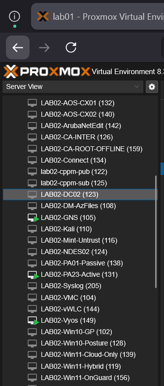

## 2. Hybrid Identity and Cloud Integration
Integration with Microsoft Entra ID and Intune is the cornerstone of the Zero Trust model.

* **Identity Synchronization:** Managed via Entra Connect.
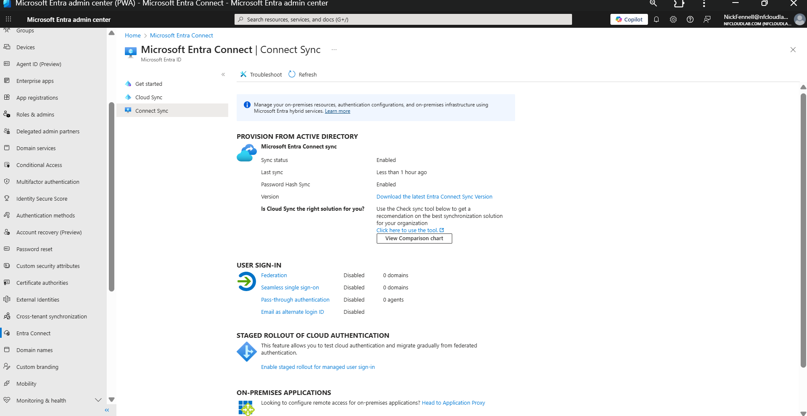
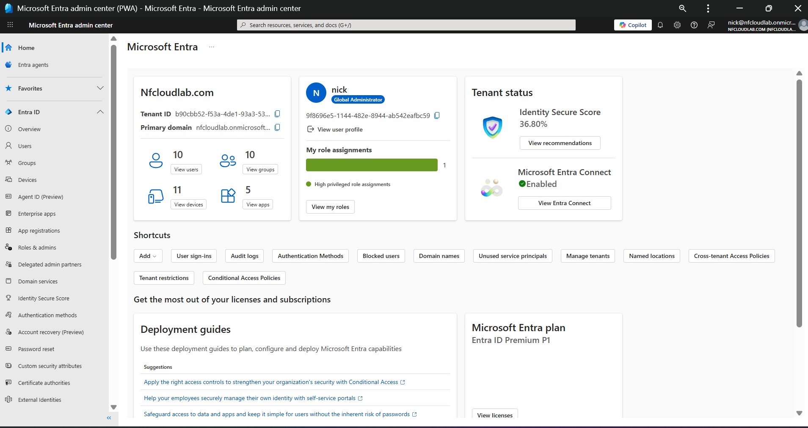

* **Enterprise Applications:** Specific app registrations for GlobalProtect and ClearPass.
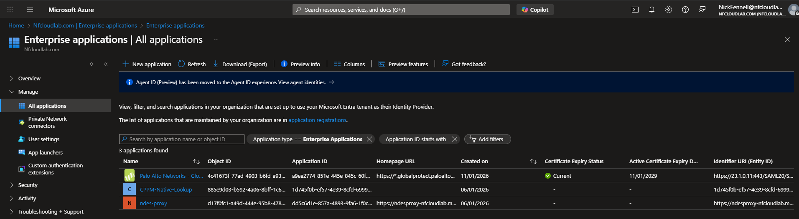
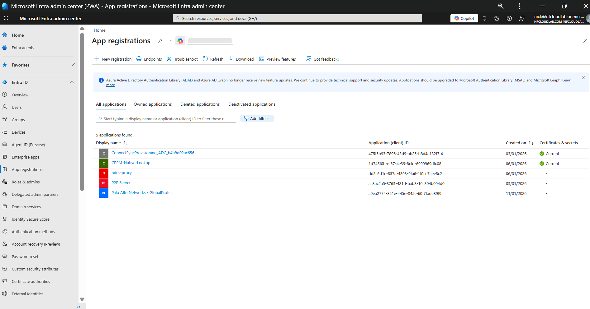

## 3. PKI Automation and SCEP Delivery
The certificate lifecycle is automated to support 802.1X and secure management access.

* **Certificate Templates:** Customized for computer and user authentication.

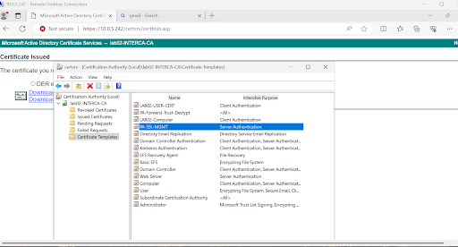

* **NDES and Certificate Connector:**

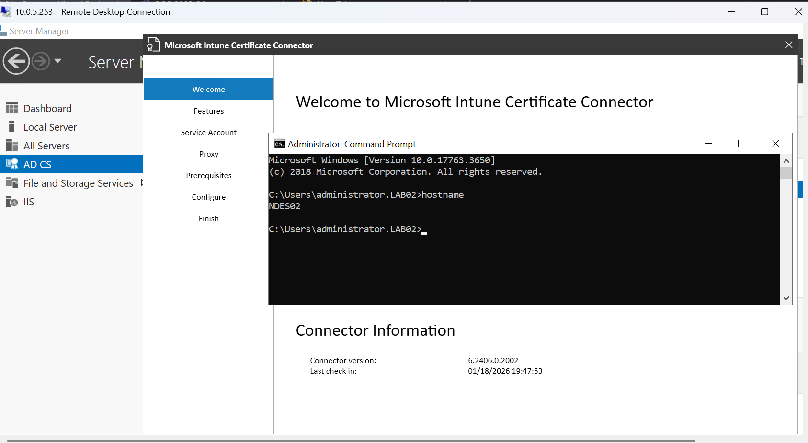

* **Registry Hardening:** MSCEP regedit configurations for SCEP challenges.
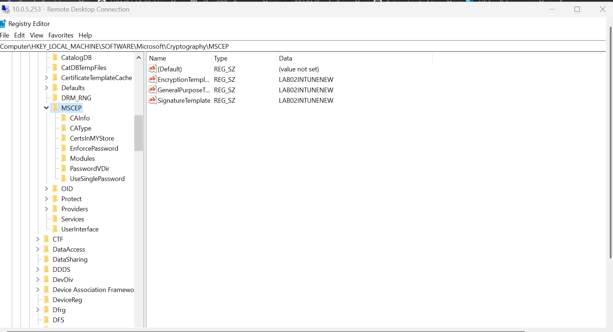

## 4. Secure Outbound Connectivity (App Proxy)
The Entra Private Network Connector avoids inbound firewall holes.

* **Outbound Tunnel:** Secure path for Intune to communicate with NDES.
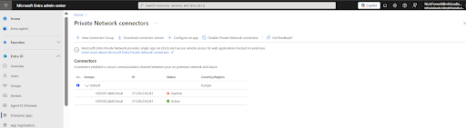

## 5. Network Management and Orchestration
* **ArubaOS-CX Switching:** Orchestrated via NetEdit.
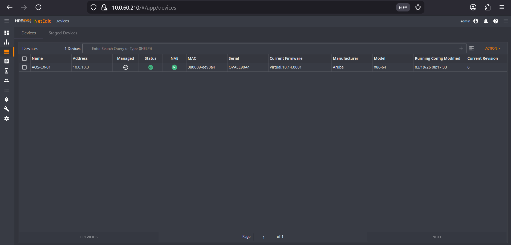

* **Wireless Fabric:** IAP portal and Aruba Central integration.
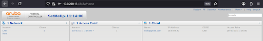
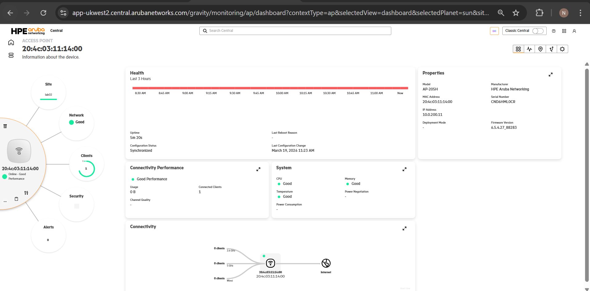

---

## General Implementation Evidence
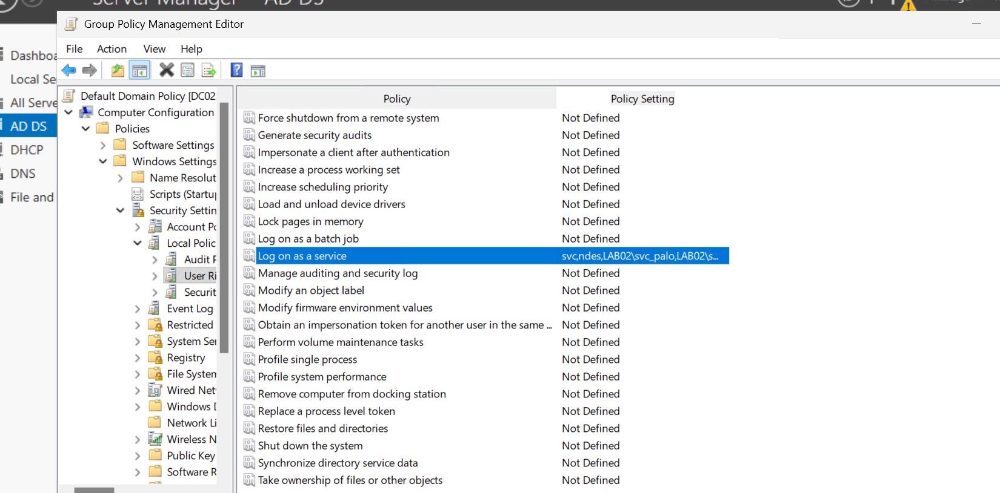

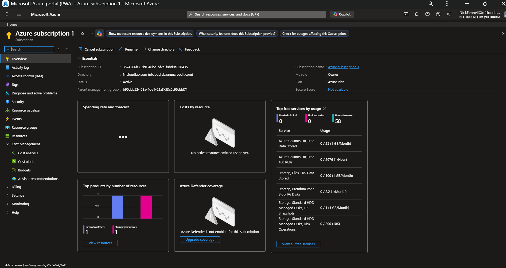