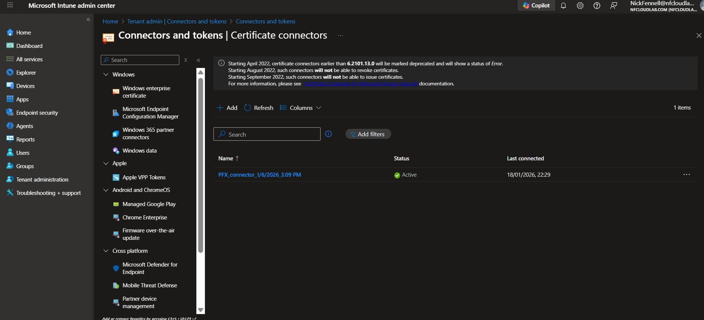
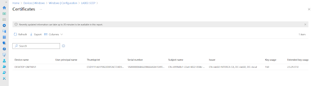
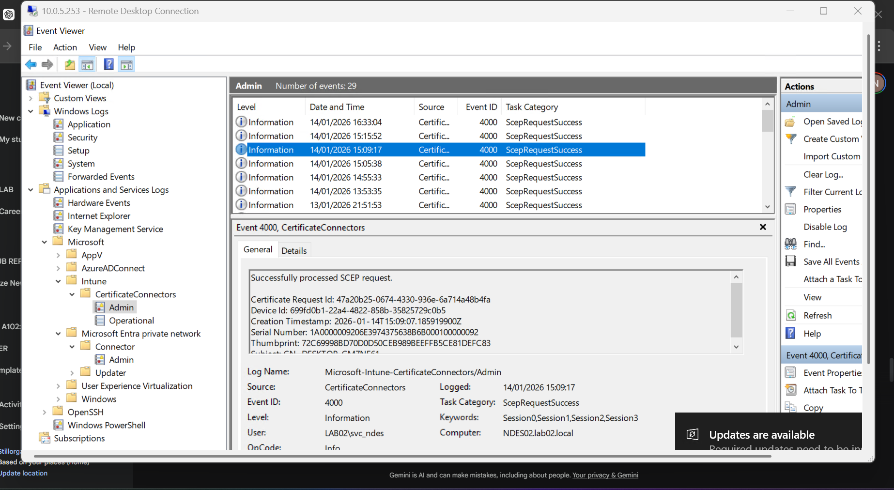
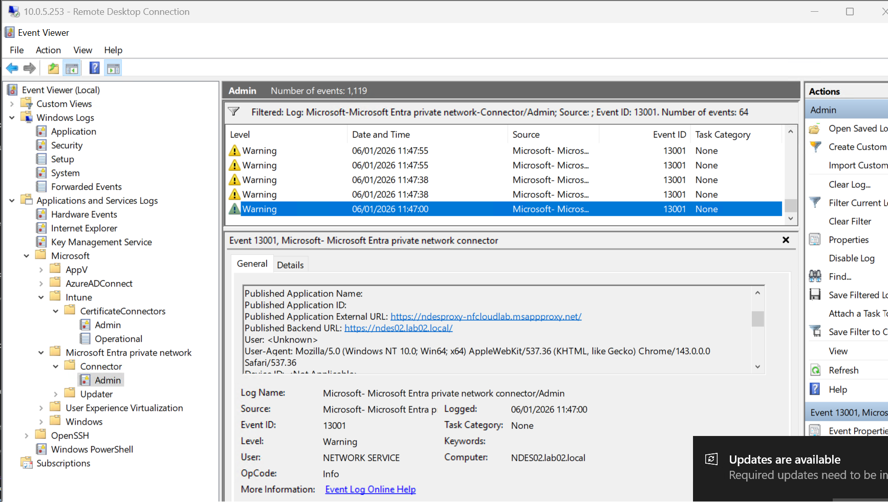
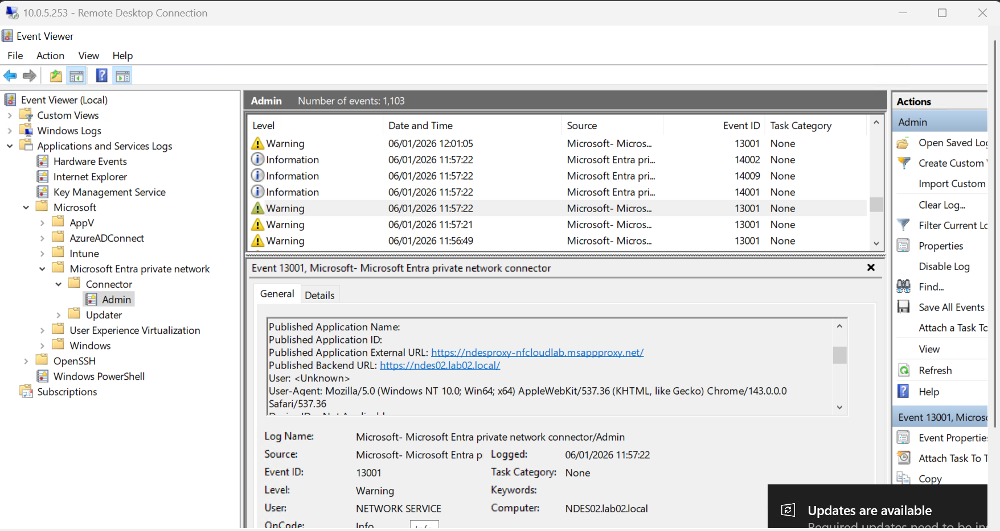
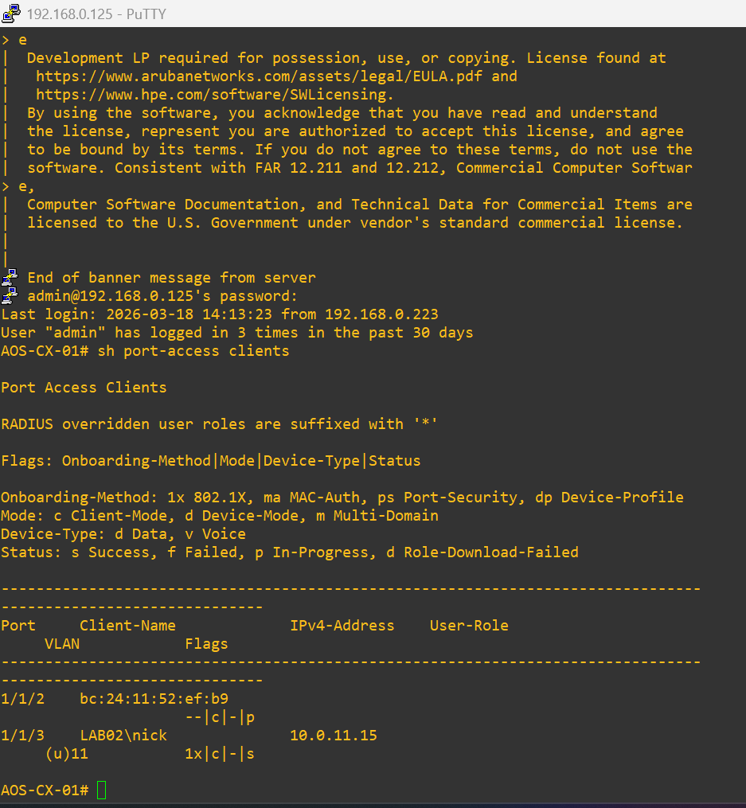

# Validation Proof: Infrastructure Core

This folder contains the technical evidence validating the baseline identity services, PKI hierarchy, and secure connector infrastructure for the hybrid environment.

## Table of Contents
* [1. Identity Synchronization (Hybrid Domain)](#1-identity-synchronization-hybrid-domain)
* [2. SCEP & Intune Certificate Infrastructure](#2-scep--intune-certificate-infrastructure)
* [3. App Proxy & Secure Connector Services](#3-app-proxy--secure-connector-services)
* [4. Network Management & Edge Baseline](#4-network-management--edge-baseline)

---

## 1. Identity Synchronization (Hybrid Domain)
Validation of the bidirectional identity handshake between on-premises Active Directory and Entra ID. This ensures users and devices are recognized across the hybrid fabric.

* **Entra Connect Sync Status:** 
* **Hybrid Domain Baseline:** 

---

## 2. SCEP & Intune Certificate Infrastructure
Evidence validating the automated certificate enrollment pipeline. This confirms the Intune Certificate Connector is processing requests from the Issuing CA.

* **Intune Certificate Connector Service:** 
* **Connector Health Verification:** 
* **Successful SCEP Enrollment:** 
* **Client-Side Certificate Store:** 
* **Event Log Audit (Event 4000):** 

---

## 3. App Proxy & Secure Connector Services
Verification of the outbound-only HTTPS conduit. These logs prove that NDES traffic is securely tunneled without inbound firewall exceptions.

* **App Proxy Connector Status:** 
* **App Proxy Event Audit (Event 13001):** 
* **NDES Secure Publishing Proof:** 

---

## 4. Network Management & Edge Baseline
The foundational networking layer, demonstrating the orchestration of the Aruba AOS-CX fabric and initial 802.1X connectivity.

* **Aruba NetEdit Orchestration:** 
* **AOS-CX 802.1X Authentication (PEAP):** 
* **Client Connection Baseline:** 

---

## Access Validation-Proof Hub
Validation evidence and configuration exports for the core infrastructure are centralized here to provide a baseline for the Transit and Identity modules.

### Cloud Networking: Evidence & Audit
* **Infrastructure Baseline:** All identity and PKI connectors confirmed active.
* **Service Redundancy:** Validated via hypervisor-level service availability.

---

**Navigation**
[Back to Parent Category](../) | [Back to Main Architecture](../../README.md)