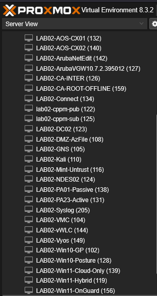

# Implementation Logic: Core Fabric and Hybrid Identity

This directory documents the configuration logic used to establish the Zero Trust foundational layer. It explains the orchestration of the virtualization environment, the synchronization of identities, and the automation of the certificate lifecycle.

---

## 1. Foundational Layer: Virtualization and Simulation
The infrastructure utilizes a Type-1 hypervisor to provide the compute density required for a multi-node Zero Trust fabric.

* **Compute Density:** The Proxmox VE cluster hosts the Policy Decision Point (ClearPass), Domain Controllers, and the Transit Security Hub (Palo Alto NVAs). This allows for a hardware-agnostic deployment that can be snapshotted during iterative policy testing.

* **Network Orchestration:** ArubaOS-CX switches are managed via **NetEdit**, providing a single pane of glass for firmware management and configuration consistency across the wired fabric.

## 2. Hybrid Identity Bridge
The "Single Source of Truth" is established by federating the on-premises Active Directory with Microsoft Entra ID.

* **Logic:** Using **Microsoft Entra Connect**, local identities are synced to the cloud. This allows the fabric to use cloud-based compliance data (from Microsoft Intune) to make local network authorization decisions at the switch port.

* **Visibility:** Successful synchronization ensures that every managed endpoint has a unique, verifiable identity in both directories, enabling seamless GlobalProtect VPN and 802.1X access.

## 3. Automated Trust: PKI and SCEP
The most critical part of this module is the automated delivery of cryptographic identities without manual administrative overhead.

* **Logic:** We utilize the Simple Certificate Enrollment Protocol (SCEP) to issue certificates. By using the **Microsoft Entra Private Network Connector (App Proxy)**, the local NDES server is exposed to Intune via an outbound-only tunnel. This eliminates the need for inbound firewall rules, maintaining a "Dark" internal posture.

* **Orchestration:** The **Intune Certificate Connector** monitors the SCEP request queue and communicates with the local Certification Authority to issue short-lived, high-assurance certificates for TEAP/EAP-TLS authentication.

## 4. Wireless Edge and Management
The wireless fabric is managed via Aruba Central, ensuring uniform policy application across local access points.

* **AP Orchestration:** Aruba Central management view for real-time telemetry and configuration audit.

* **Captive Portal:** The IAP-based redirect logic for secure guest isolation.

---

## 5. Engineering Deep-Dives
For a technical breakdown of the logic used in this module, refer to the following engineering analysis notes:

* **[PKI Lifecycle: SCEP and NDES Integration](../../docs/tech-notes/pki-scep-lifecycle.md)**: Detailed analysis of the outbound-only certificate delivery logic.
* **[Identity Federation Logic](../../docs/tech-notes/app-proxy-logic.md)**: Breakdown of the Entra App Proxy and its role in Zero Trust.

---

## Navigation
[Back to Top](#implementation-logic-core-fabric-and-hybrid-identity) | [Back to Infrastructure Index](../README.md) | [Back to Main Architecture](../../README.md)