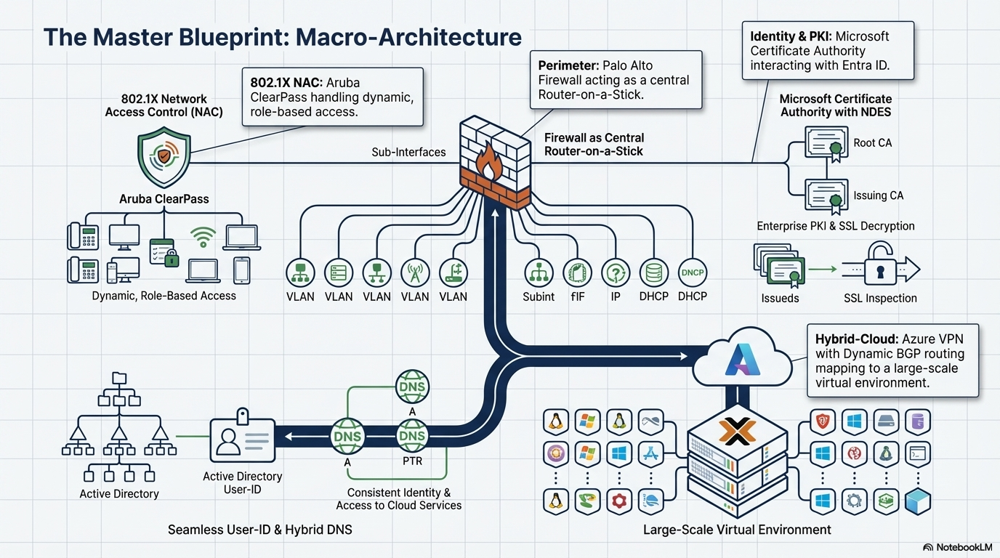
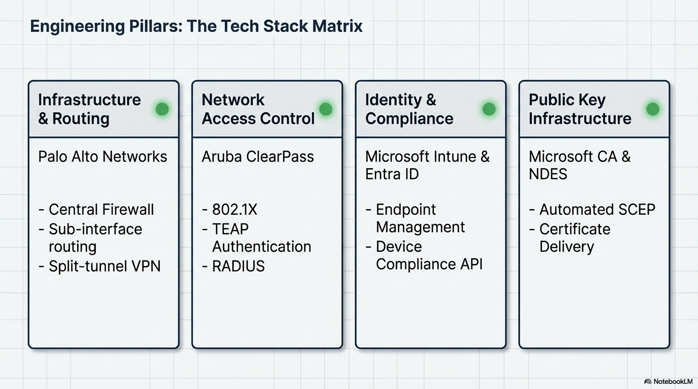
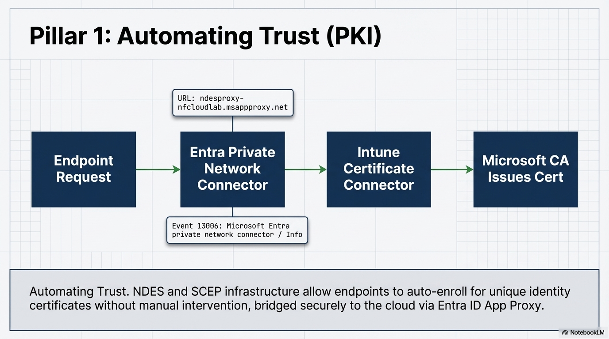
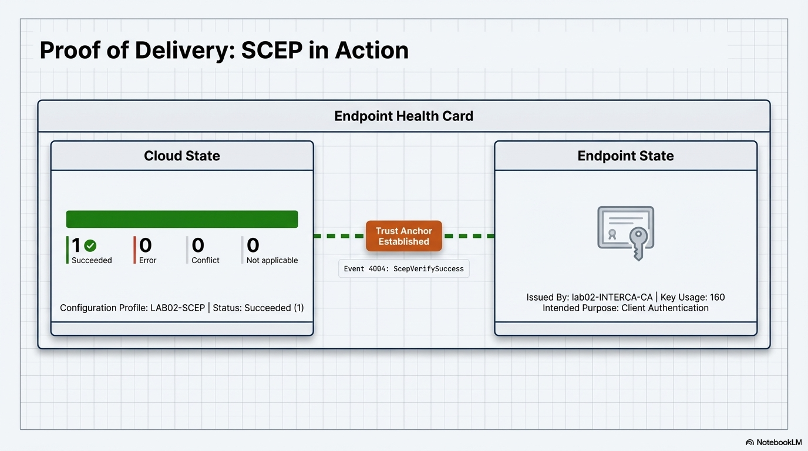
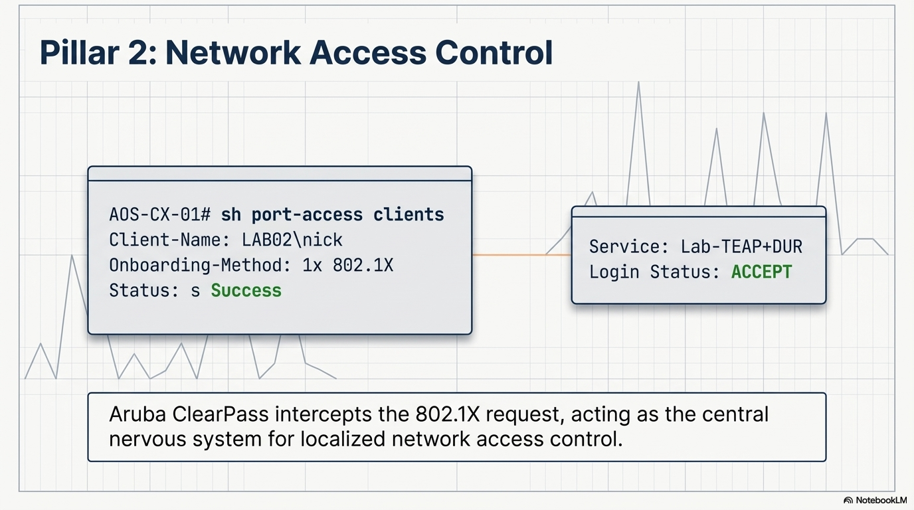

# Validation Proof: Infrastructure Core Dossier

This folder contains the engineering blueprints and technical validation evidence for the Zero Trust Identity Fabric.

---

## 1. Macro Architecture & Strategy
* **Master Macro-Architecture:** 
* **Engineering Pillars:** 

## 2. Pillar 1: Identity & PKI Automation
* **Automating Trust Flow:** 
* **Proof of Delivery (SCEP in Action):** 
* **Infrastructure Baseline:** 

---

## Navigation
[Back to Infrastructure Index](../README.md) | [Back to Main Architecture](../../README.md)