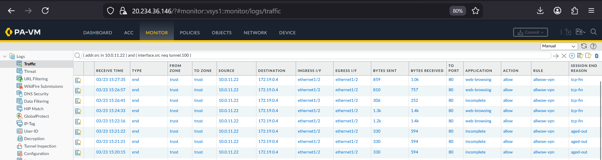

# Implementation Logic: Azure Transit Security Hub

This directory documents the as-built configuration that executes the Dual-Tunnel Transit design. It details the specific Azure routing tables, load balancer configurations, and NVA traffic steering logic required to maintain stateful inspection.

---

## 1. Direct S2S Tunnel & Internet Breakout (Tunnel 1)
The implementation utilizes a direct S2S IPsec tunnel terminating on the Palo Alto NVA for all internet-bound traffic originating from the on-premises Site 1.

* **Logic:** By terminating the tunnel directly on the NVA (via the External Load Balancer), we bypass the standard Azure Gateway for internet-bound traffic. This ensures the Palo Alto L7 engine has full visibility into outbound flows before they exit the Azure edge.
* **Split Routing Proof:** Validation of the split tunnel architecture separating internet and backbone traffic.

* **Deep Dive:** [Palo Alto Azure Transit](../../docs/tech-notes/palo-azure-transit.md)

## 2. Ingress Steering & VPN Gateway UDR (Tunnel 2)
To satisfy the requirement for 100% inspection of hybrid traffic, native Azure system routing is overridden at the gateway level.

* **Logic:** A User-Defined Route (UDR) is attached to the **GatewaySubnet**. This route table forces traffic arriving from the on-premises VPN Gateway to hit the NVA Trust interface before reaching the spokes.
* **NVA Gateway Routing Proof:**

* **VPN to Spoke Flow Logs:**

## 3. Spoke Egress & Traffic Steering
Workload spokes are configured to recognize the Transit Hub as their primary security boundary.

* **Logic:** Subnet-level UDRs point the default route and inter-VNet routes to the Internal Load Balancer VIP. 
* **Spoke Client Validation:**

## 4. High Availability & Backbone BGP
The hybrid backbone utilizes dynamic routing to share spoke address spaces while maintaining the isolated overlay for inspection.

* **BGP Adjacency:** Validation of the BGP peering established over the VPN Gateway tunnel.

* **POC Architecture Architecture View:**

## 5. Security Policy Enforcement
* **Logic:** The Palo Alto utilizes User-ID and Security Profiles to enforce the security mandate on all transit traffic.
* **L7 Inspection Logs:**

* **Deep Dive:** [Palo Alto Security Logic](../../docs/tech-notes/palo-alto-security.md)

---

## Navigation
[Back to Top](#implementation-logic-azure-transit-security-hub) | [Back to Transit Index](../README.md) | [Back to Main Architecture](../../README.md)