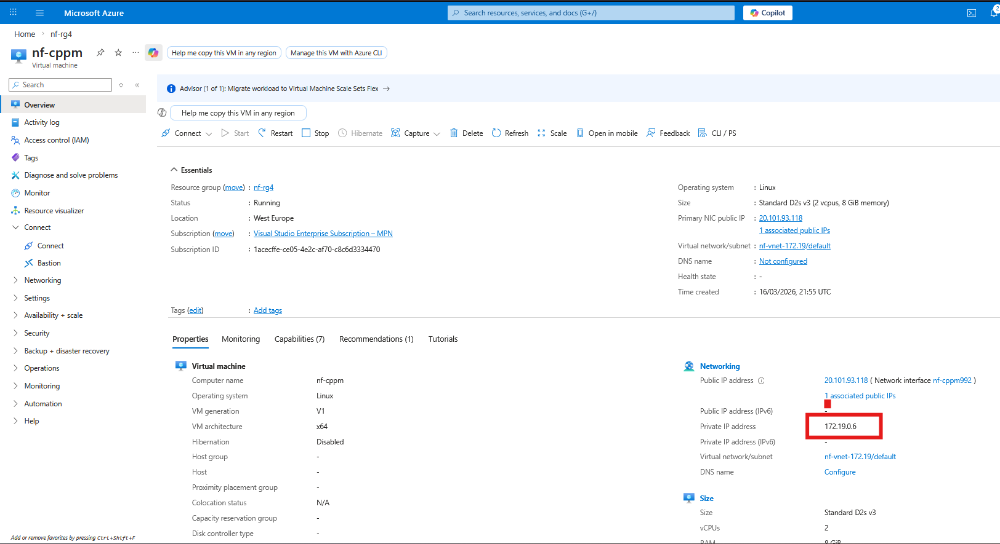
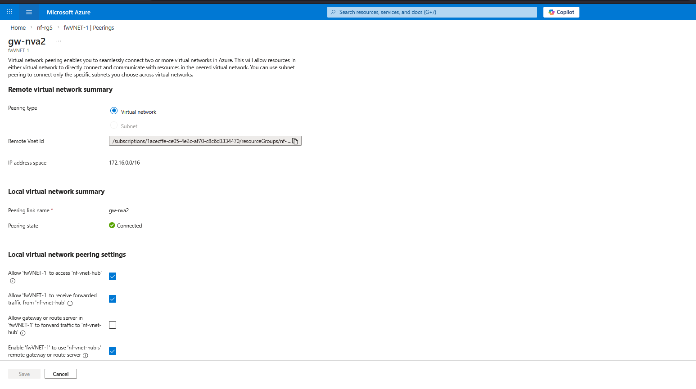

# Implementation Logic: Azure Transit Security Hub

This directory documents the technical configuration of the Multi-Tunnel Transit Hub. It details the Azure Load Balancer orchestration, Route Table (RT) steering, and the specific routing path required for hybrid 802.1X authentication against the cloud-resident identity engine.

---

## 1. High Availability: Azure Load Balancer (SLB)
The NVA cluster is fronted by an Internal Load Balancer (ILB) to provide a consistent Next Hop for all internal traffic flows, ensuring session persistence and symmetry.

* **ILB VIP Configuration:** The ILB provides a private Front-end IP that serves as the gateway for the entire hub-and-spoke fabric.

* **Session Persistence:** The Load Balancer is configured with specific hash-based persistence to ensure return traffic hits the same NVA instance that processed the initial request.

## 2. Hybrid Identity Solution: Cloud-Resident CPPM3
A primary feature of this implementation is the redirection of on-premises 802.1X traffic to the `CPPM3` node located in the Azure Identity segment.

* **CPPM3 Azure VM Deployment:** The identity engine is hosted as a dedicated virtual appliance within the Azure Hub, providing the Policy Decision Point (PDP) for the entire fabric.

* **RADIUS Trust:** The server certificate installed on `CPPM3` to establish secure TEAP and EAP-TLS tunnels with on-premises endpoints over the transit path.

* **Deep Dive:** [ClearPass Advanced Services](../../docs/tech-notes/clearpass-advanced-services.md)

## 3. Traffic Steering: Azure Route Tables (RT)
User-Defined Routes (UDRs) are utilised to override default Azure system routing and force authentication traffic through the NVA security edge.

* **Gateway Ingress Steering:** A specific UDR attached to the **GatewaySubnet** intercepts RADIUS traffic arriving from the VPN Gateway and redirects it to the NVA Trust interface.

* **Spoke & Identity Steering:** Every workload subnet (including the Identity segment) contains a default route (`0.0.0.0/0`) pointing to the Internal Load Balancer VIP to ensure all egress and return traffic is inspected.

## 4. NVA Routing & Security Policy
The Palo Alto NVAs utilise separate Virtual Routers and Security Policies to manage the high-security identity flow.

* **Trust VR Logic:** Manages internal routes and ensures traffic destined for the `CPPM3` subnet is correctly handled via the hybrid backbone.

* **Hybrid Authentication Flow Proof:** Security logs from the NVA cluster validate that RADIUS traffic from on-premises switches is successfully reaching the cloud-resident CPPM3.

* **Deep Dive:** [Palo Alto Security Logic](../../docs/tech-notes/palo-alto-security.md)

## 5. Hybrid Connectivity: S2S Tunnels & BGP
The hybrid backbone is established using a dual-tunnel strategy with dynamic route propagation via BGP.

* **Tunnel Interface Status:** Implementation of the Phase 1 and Phase 2 IPsec security associations on the Palo Alto NVA.

* **BGP Adjacency:** Established between the NVA cluster and the Azure VPN Gateway to automate route sharing across the fabric.

## 6. VNet Peering & Transit Orchestration
Hub-and-Spoke connectivity is managed via VNet Peerings with Gateway Transit enabled.

* **Transit Configuration:** Confirmation of the "Use Remote Gateways" and "Allow Gateway Transit" settings across the fabric.

---
[Back to Top](#implementation-logic-azure-transit-security-hub) | [Back to Main Architecture](../../README.md)