# Implementation Logic: Transit and Routing Architecture

This section documents the configuration logic used to establish the Hybrid Transit Hub. It demonstrates how the environment bypasses single-tunnel bottlenecks to achieve enterprise-grade load balancing and symmetric split-routing.

---

## 1. The Enterprise Transit Solution
To eliminate the scaling limitations of terminating IPsec directly on an NVA, the cryptography is offloaded to the Azure VPN Gateway, and inner-IP traffic is load-balanced to the Palo Alto firewalls.

* **On-Premises Tunnels:**
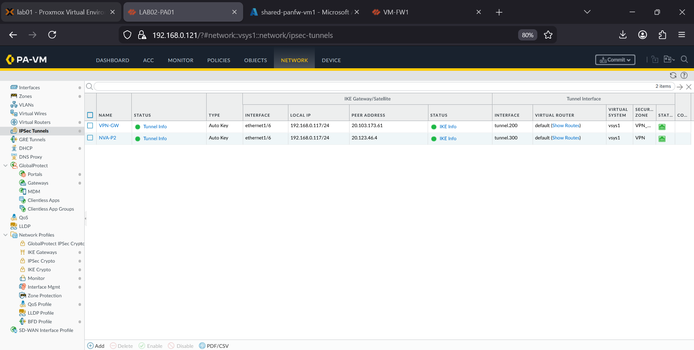
* **NVA Azure Tunnels:**
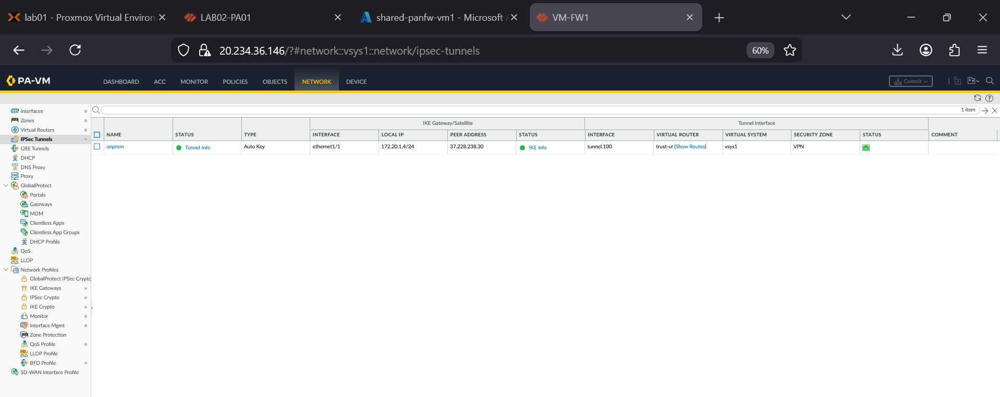
* **Internal Load Balancer (ILB):**
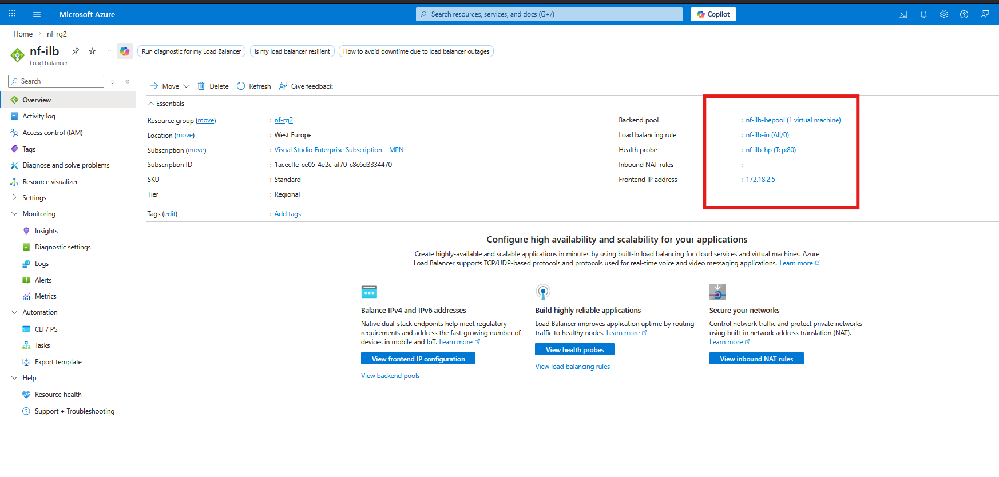

## 2. Split-Routing and The Gateway Subnet Hack
This architecture uses User-Defined Routes (UDRs) and the "Longest Prefix Match" rule to force-tunnel ingress traffic from the VPN Gateway through the NVA cluster.

* **Gateway Routing Table (UDR):**

* **Spoke Routing Table (UDR):**

* **Route Table Logic (BGP):**
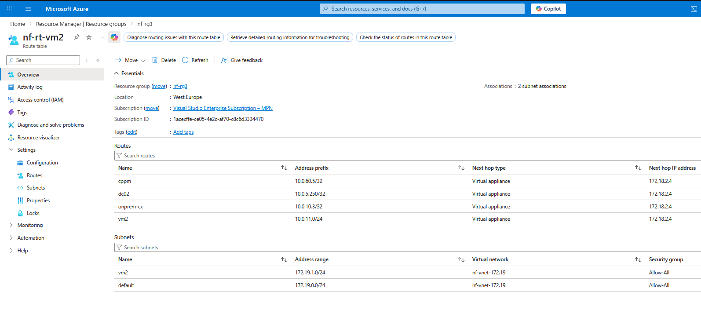
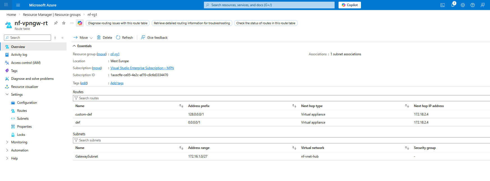

## 3. Azure VNet Peering Fabric
Specific peering relationships allow the Hub and Spokes to communicate strictly through the NVA inspection point.

* **Gateway to NVA Peering:** 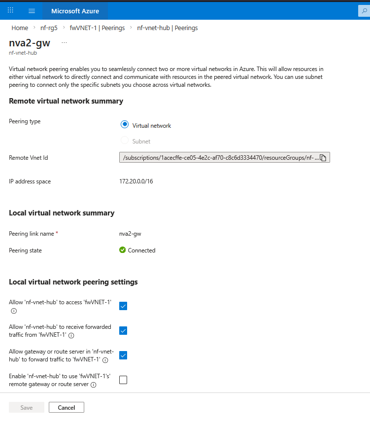
* **NVA to Spoke Peering:** 
* **Peering to Spoke Evidence:** 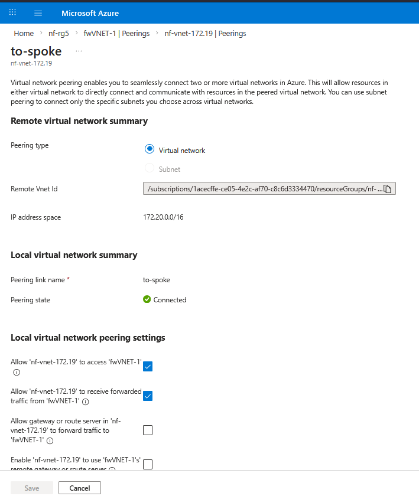

## 4. Symmetric Return via Policy-Based Forwarding (PBF)
PBF ensures traffic returns symmetrically, preventing the stateful firewalls from dropping out-of-state packets.

* **Trust VR:** 
* **Untrust VR:** 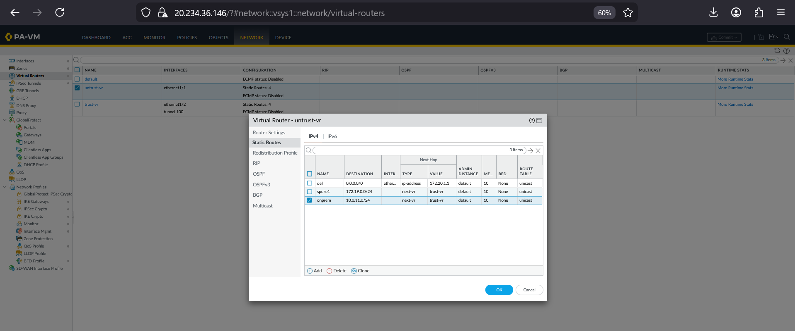
* **PBF Rulebase:** 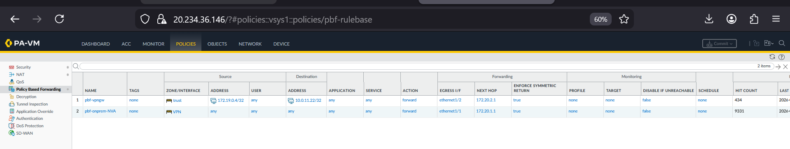

## 5. Security Services and Translation
* **BGP Adjacency:**

* **NAT Rulebase:**
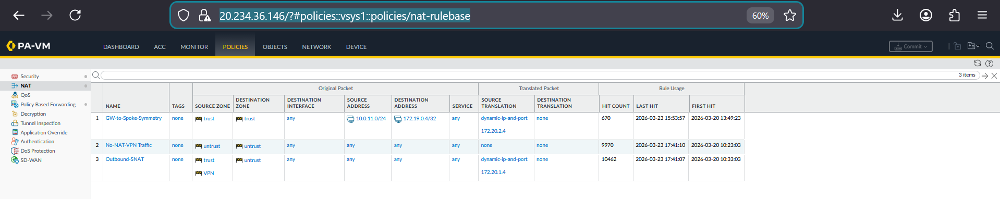
* **External Dynamic Lists (EDL):**
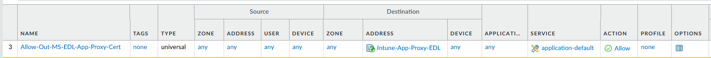
* **Load Balancer Persistence:**
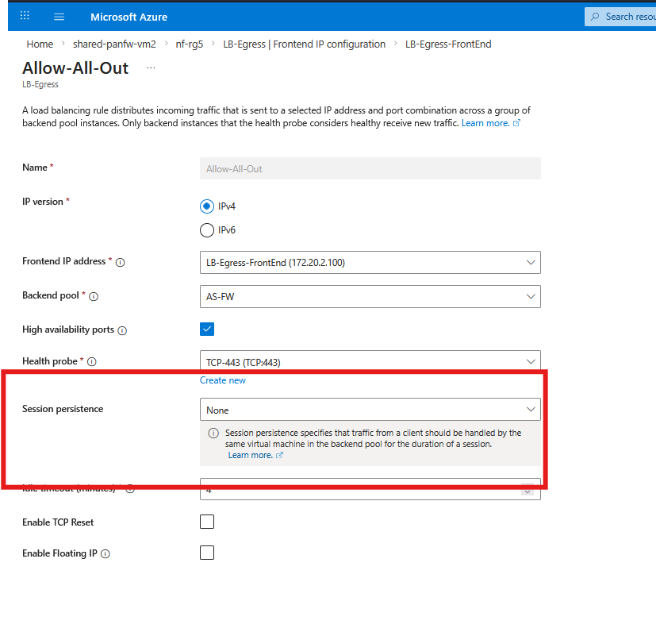

---

## Navigation
[Back to Main Architecture](../../README.md)