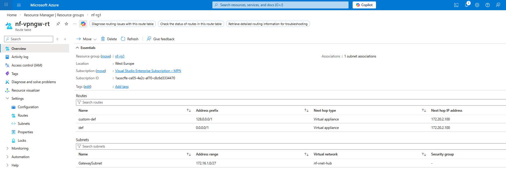
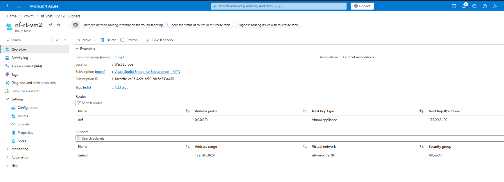
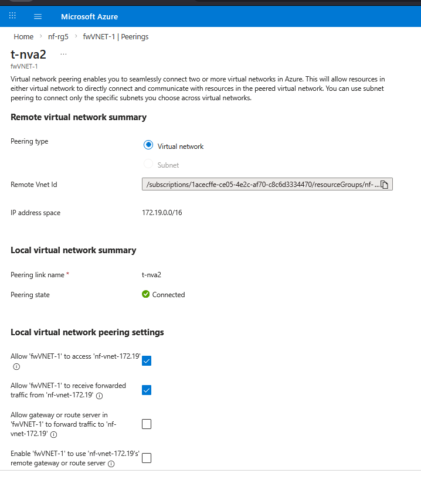
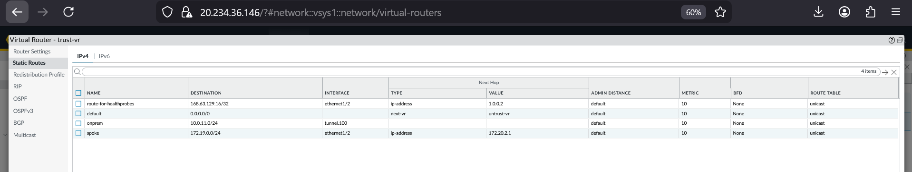

# Implementation Logic: Transit and Routing Architecture

This section documents the configuration logic used to establish the hybrid transit hub, demonstrating how the environment bypasses single-tunnel bottlenecks to achieve enterprise-grade load balancing and symmetric split-routing.

## 1. The Enterprise Transit Solution
To eliminate the Active/Active scaling limitations of terminating IPsec directly on an NVA, the cryptography is offloaded to the Azure VPN Gateway, and inner-IP traffic is load-balanced to the Palo Alto firewalls.

* **On-Premises Tunnels:** 
* **NVA Azure Tunnels:** 
* **Internal Load Balancer (ILB):** 
  *Note: The Azure ILB fronting the NVA cluster allows for session hashing across multiple firewall nodes.*

## 2. Split-Routing & The Gateway Subnet Hack
With the tunnel established on the Gateway, Azure User-Defined Routes (UDRs) are utilized to enforce the split-routing topology. 

### The VPN Gateway Route
Azure restricts applying a standard default route (0.0.0.0/0) to the GatewaySubnet because it hijacks the gateway's backend management traffic, causing the IPsec tunnels to drop. To bypass this while still forcing all ingress traffic to the firewall, this architecture uses the Longest Prefix Match rule.

* **Gateway Routing Table (UDR):** 
* **The Logic:** We split the IPv4 space in half using two routes: 0.0.0.0/1 and 128.0.0.0/1. Because a /1 route is more specific than a /0 system route, these rules supersede the default routing behavior without triggering Azure's control plane protections. Any traffic arriving from the on-premises Local Network Gateway immediately hits these /1 routes and is forwarded to the Palo Alto ILB.

### The Spoke Route
* **Spoke Routing Table (UDR):** 
* **The Logic:** The default 0.0.0.0/0 route forces all outbound traffic from the spoke directly to the ILB for inspection.

## 3. Azure VNet Peering Fabric
To support the transit routing, specific peering relationships are established, allowing the gateway and the spokes to communicate strictly through the NVA hub.

* **Gateway to NVA Peering:** 
* **NVA to Gateway Peering:** 
* **NVA to Spoke Peering:** 

## 4. Symmetric Return via Policy-Based Forwarding (PBF)
While UDRs force traffic to the firewall, Policy-Based Forwarding (PBF) ensures the traffic returns symmetrically, preventing the stateful firewall from dropping out-of-state return packets.

### Virtual Router (VR) Configuration
The Palo Alto requires distinct Virtual Routers to prevent static routes from overriding the intended split-routing path.
* **Trust VR:** 
* **Untrust VR:** 

### The PBF Override
Instead of relying solely on the VR static routes, PBF intercepts the return traffic.
* **PBF Rulebase:** 

### The Inbound VPN Symmetry Rule (pbf-onprem-NVA)
When traffic originates from the on-premises environment via the direct NVA tunnel, it enters the VPN zone. 

* **The Forwarding Action:** The PBF rule captures this traffic and forces it into the Azure fabric via the internal interface.
* **Enforce Symmetric Return:** By enabling this setting, the firewall creates a strict session state. When the Azure Spoke replies to the on-premises request, the firewall intercepts the return packet and forces it back out the exact same direct IPsec tunnel it arrived on. 
* **The Outcome:** This completely bypasses the standard Virtual Router routing table for return traffic, ensuring perfect stateful symmetry and preventing dropped packets in a multi-tunnel environment.

### Network Address Translation (NAT)
* **NAT Rulebase:** 
* **The Logic:** NAT is used selectively to ensure that dynamic IP translation aligns with the required routing paths for both internal transit and internet breakout.

---

## Live Traffic Validation
The screenshots in this document prove the configuration logic. To view the resulting live traffic logs, BGP telemetry, and end-to-end flow evidence confirming this routing behavior, please refer to the Validation Proof hub.

[View Live Validation Evidence](../validation-proof/README.md)