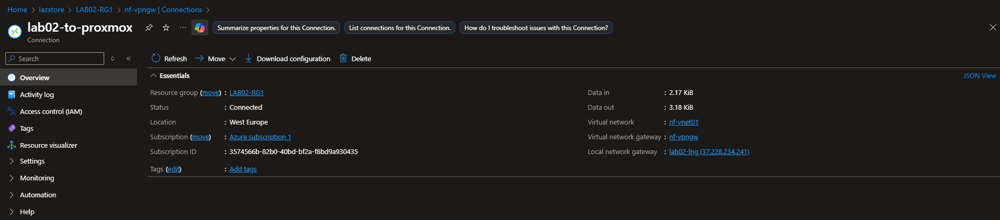
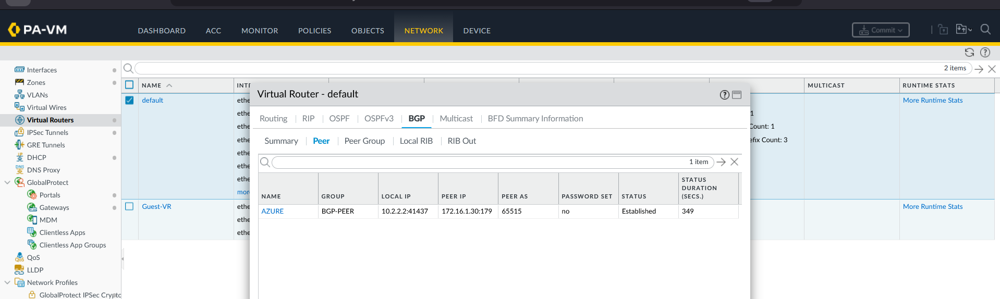
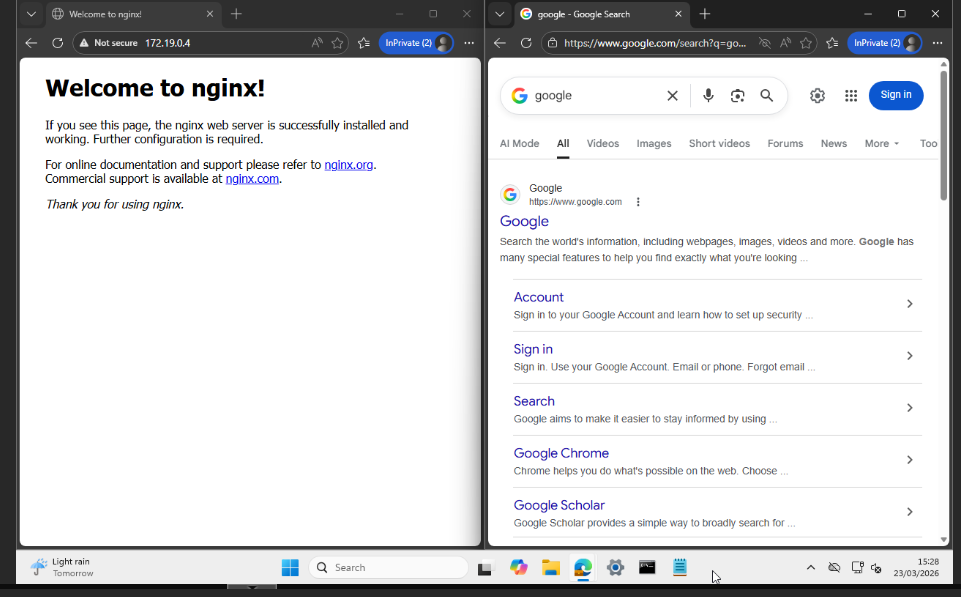
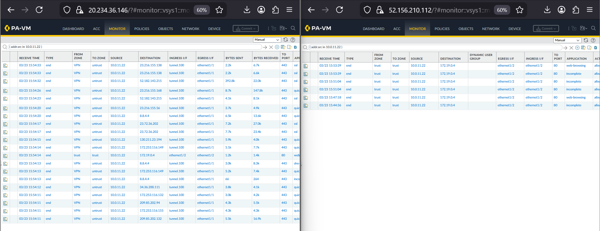
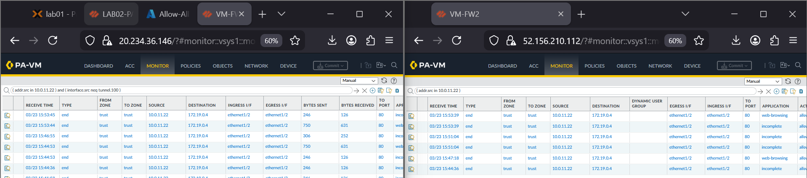

# Validation Proof: Transit Security Hub (Azure)

This folder contains the technical evidence validating the Multi-Tunnel Transit Hub, BGP propagation, and the Split-Routing architectural solution between On-Premises and Azure.

## Table of Contents
* [1. Hybrid Connectivity Status](#1-hybrid-connectivity-status)
* [2. BGP & Routing Propagation](#2-bgp--routing-propagation)
* [3. Split-Routing Verification (Validated Solution)](#3-split-routing-verification-validated-solution)
* [4. NVA Inspection & Flow Evidence](#4-nva-inspection--flow-evidence)

---

## 1. Hybrid Connectivity Status
This section confirms that the S2S IPsec tunnels are established and stable. This forms the foundation for the dual-path transit architecture.

* **S2S Tunnel Verification:** 
* **Client-to-Spoke Reachability:** 

---

## 2. BGP & Routing Propagation
Evidence of the dynamic route exchange between the On-Premises Palo Alto and the Azure VPN Gateway. This ensures the management backbone (Tunnel 200) remains highly available.

* **BGP Peering & Prefix Exchange:** 
* **VPN Gateway Traffic Logs:** 

---

## 3. Split-Routing Verification (Validated Solution)
The core "Evidence of Success" for this lab. These screenshots prove that traffic is being steered across two different paths: one for internal management and one for high-security NVA breakout.

* **Split-Routing Logic & Table Verification:** 
* **NVA vs. Gateway Pathing Analysis:** 
* **Traceroute/Routing Logic Validation:** 

---

## 4. NVA Inspection & Flow Evidence
This evidence proves that traffic hitting the Azure Spoke is successfully backhauled to the Palo Alto NVA for Layer 7 inspection and User-ID mapping.

* **On-Prem to NVA Traffic Logs:** 
* **End-to-End Traffic Flow Proof:** 

---

## Access Validation-Proof Hub
Validation evidence and configuration exports for this service are centralized in this module-level hub to provide a clear audit trail of the transit path.

### Cloud Networking: Evidence & Audit
* **Validation Status:** All split-tunnel routes confirmed active.
* **Symmetric PBF:** Return paths validated via NVA session state.

---

**Navigation**
[Back to Parent Category](../) | [Back to Main Architecture](../../README.md)