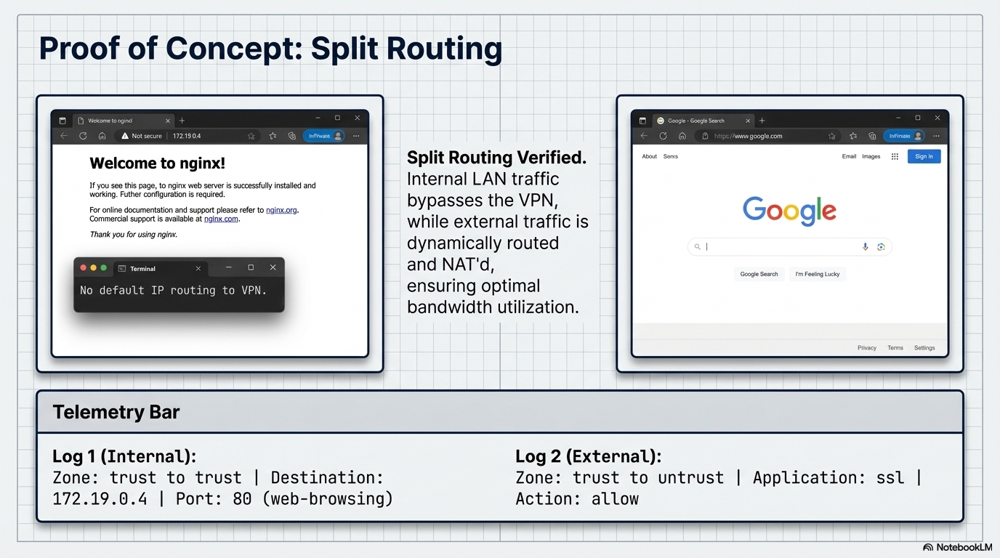
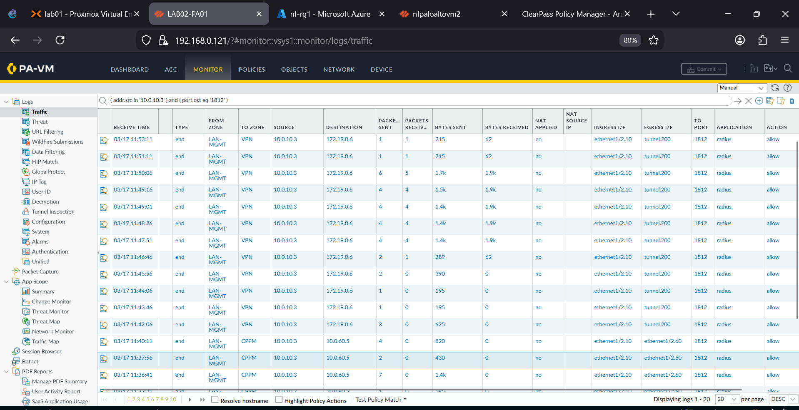
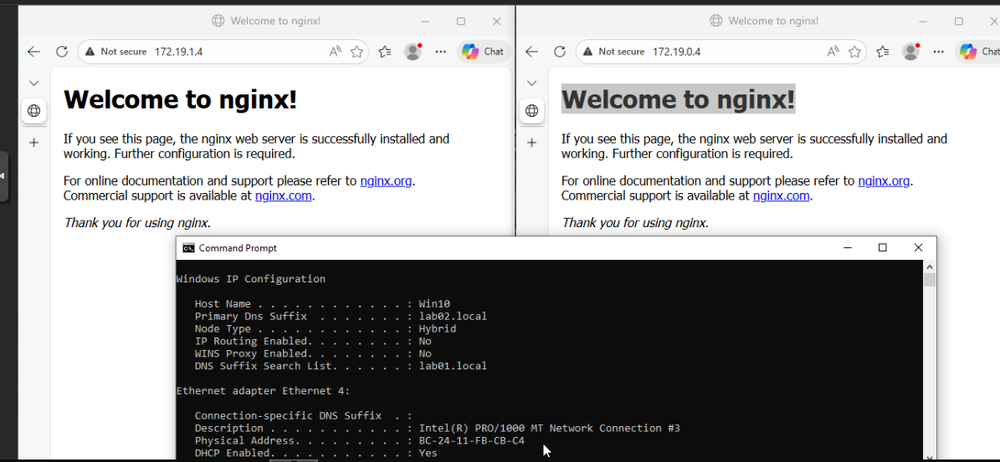

# Validation Proof: Transit Security Hub (Azure)

This folder contains the technical evidence and engineering blueprints validating the Multi-Tunnel Transit Hub and the Split-Routing architectural solution between On-Premises and Azure.

---

## 1. Hybrid Connectivity & Macro Architecture
Confirmation of the established S2S IPsec tunnels and the global integration between the Proxmox DC and the Azure environment.

* **Hybrid Master Blueprint:**

* **S2S Tunnel Status:**

* **BGP Adjacency (VPNGW):**

---

## 2. Split-Routing Verification (Validated Solution)
Technical proof of the split-routing logic, demonstrating traffic steering across separate paths for management and high-security NVA breakout.

* **Split-Routing Logic Analysis:**

* **NVA Pathing Verification:**

* **Traceroute & ICMP Path Validation:**

---

## 3. NVA Inspection & Flow Evidence
Validation that traffic hitting Azure Spokes is successfully backhauled to the Palo Alto NVA for Layer 7 inspection and User-ID mapping.

* **Palo Alto NVA Flow Logs:**

* **End-to-End Traffic Flow Proof:**

* **Azure Spoke Client Validation:**

---

## 4. Supplementary Evidence Logs
* **VPN Gateway Spoke Logs:** [./images/2303_logs_vpn_gw_spoke.png](./images/2303_logs_vpn_gw_spoke.png)
* **General Split-Routing Evidence:** [./images/proof_split_routing.png](./images/proof_split_routing.png)