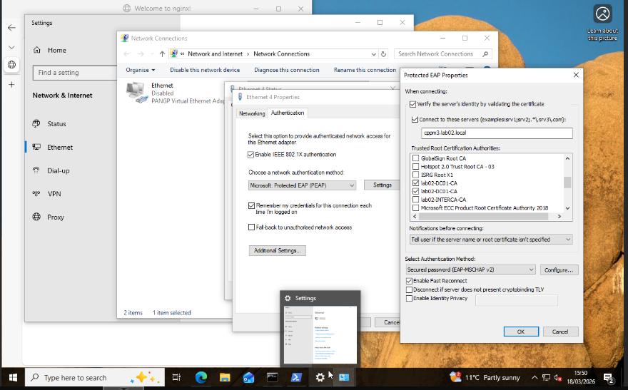
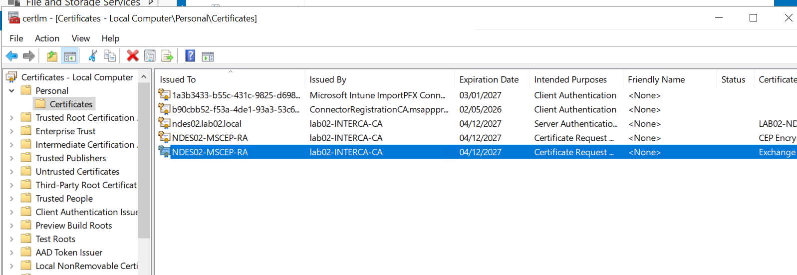

# Implementation Logic: Policy Engine & Cloud Integration

This directory documents the technical configuration of the Policy Decision Point (PDP). It details the ClearPass service logic, the Intune Graph API integration, and the captive portal orchestration for guest access.

---

## 1. ClearPass (CPPM) Service Orchestration
The CPPM cluster handles the RADIUS handshake and evaluates enforcement policies based on user identity and device health.

* **Service Pipeline:** A consolidated view of the RADIUS and Web-Auth services.

* **RADIUS Trust:** The server certificate used for secure EAP-TLS/PEAP handshakes.

* **Resource Deployment:** JSON export of the CPPM resource group logic.
`rg_cppm.json`

## 2. Microsoft Intune & Cloud Bridge
To achieve posture-based access, ClearPass is integrated with the Microsoft Graph API via the Intune Extension.

* **Intune Extension v6.4.1:** The primary bridge for compliance lookups.

* **Attribute Mapping:** Specific JSON attributes pulled from Intune to determine device health.

* **SCEP Profiles:** Intune-side configuration for automated certificate delivery.

* **App Proxy Logic:** Outbound-only connectivity for the NDES/CPPM cloud handshake.

## 3. Guest Access & Captive Portal
The environment provides a secure, isolated guest flow using a web-based captive portal.

* **Portal Configuration:** The ClearPass Guest skin and field logic.

* **IAP Integration:** Aruba Instant AP configuration for redirecting guest clients.

## 4. Authentication Proof
* **Windows PEAP Verification:** Verification of a successful PEAP-MSCHAPv2 handshake from a Windows 10/11 client.

---

## 5. Supplementary Implementation Evidence
These snapshots document the iterative configuration of NDES certificates and general service status:

* **NDES/MSCEP Certificates:** 
* **VM Run-State Log:** `sh_run_cppm_vm_w.txt`
* **Historical Logic Snapshots:** (See the `images/` folder for timestamped captures of the AD DS sync and service-level regedit tweaks.)