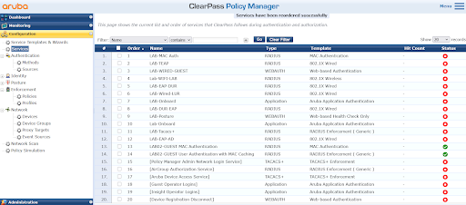
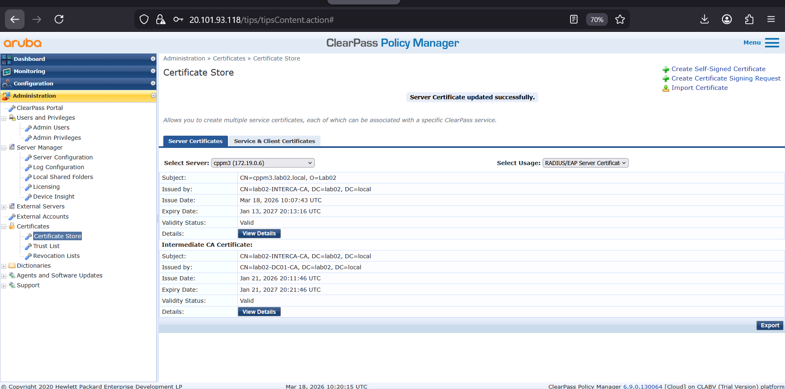
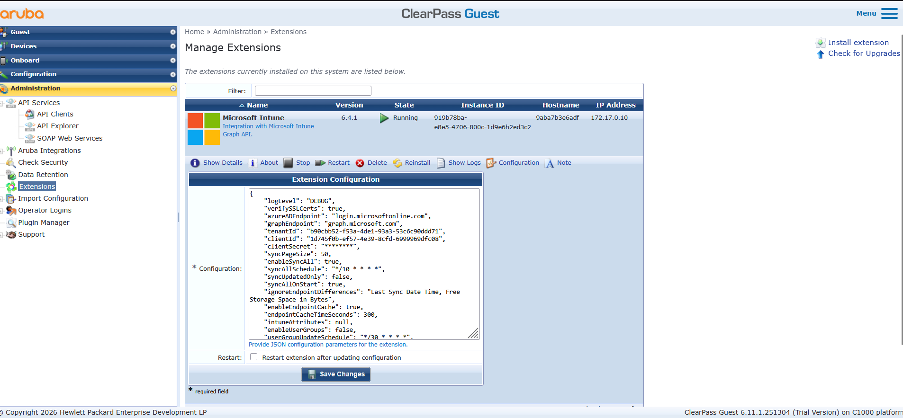
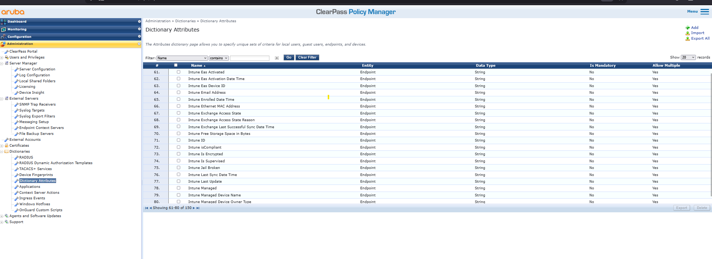
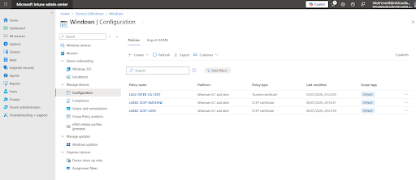
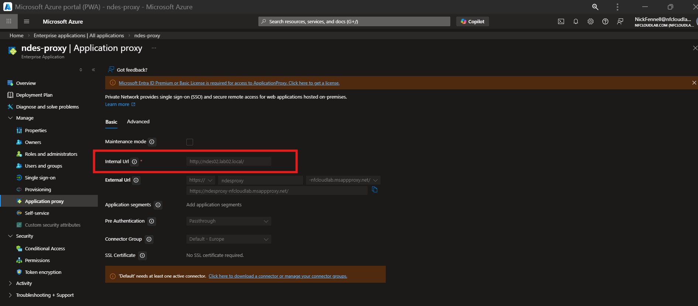
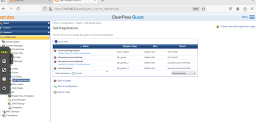
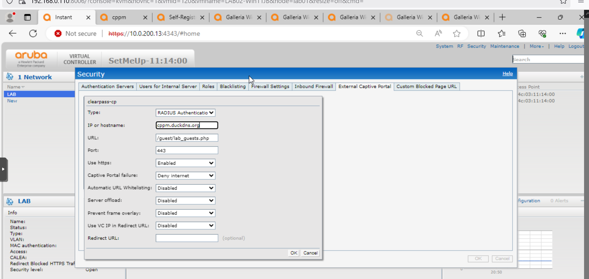

# Implementation Logic: Identity and Policy Orchestration

This section documents how the Policy Decision Point (PDP) is implemented. It covers ClearPass service orchestration, Microsoft Intune (Graph API) integration, and guest access workflows used to enforce identity-driven Zero Trust access.

---

## 1. ClearPass (CPPM) Service Orchestration

The ClearPass cluster processes all authentication requests and applies policy decisions based on identity and device compliance.

This forms the core enforcement engine of the Zero Trust architecture.

* **Service Pipeline:**  
  A consolidated view of active RADIUS and Web-Auth services within ClearPass.

* **RADIUS Trust:**  
  The server certificate used to establish secure TEAP (EAP-FAST) and EAP-TLS authentication tunnels with endpoints.

* **Policy Evaluation:**  
  Authentication requests are evaluated against multiple sources, including:
  - Active Directory (identity)  
  - Intune (device compliance)  
  - Local enforcement policies  

* **Deep Dive:**  
  [ClearPass Advanced Services](../../docs/tech-notes/clearpass-advanced-services.md)

---

## 2. Microsoft Intune Integration (Cloud Compliance Bridge)

To enable cloud-driven authorization, ClearPass integrates with Microsoft Intune via the Graph API.

This replaces traditional NAC posture checks with real-time compliance signals.

* **Intune Extension (v6.4.1):**  
  Acts as the API bridge between ClearPass and Microsoft Graph, allowing real-time compliance queries during authentication.

* **Attribute Mapping:**  
  JSON attributes retrieved from Intune are mapped into ClearPass enforcement logic to determine access level.

* **Authorization Logic:**  
  Devices must be marked as **Compliant** in Intune to receive full network access.

* **SCEP Profiles & App Proxy:**  
  Intune is configured for automated certificate delivery via SCEP, using Entra App Proxy to enable secure outbound-only communication.

* **Deep Dive:**  
  [Entra App Proxy](../../docs/tech-notes/entra-app-proxy.md)  
  [PKI SCEP Lifecycle](../../docs/tech-notes/pki-scep-lifecycle.md)

---

## 3. Guest Access and Captive Portal

The environment includes a segregated guest access workflow using ClearPass Guest and Aruba Instant AP integration.

This allows unmanaged devices to securely access the network without compromising internal resources.

* **Portal Configuration:**  
  Defines the ClearPass Guest portal, including registration fields and authentication workflow.

* **IAP Integration:**  
  Aruba Instant APs intercept unauthenticated traffic and redirect users to the captive portal for onboarding.

* **Dynamic Segmentation:**  
  Guest users are assigned to isolated VLANs with restricted access policies.

---

## 4. Dynamic Enforcement (DUR Integration)

Following successful authentication, ClearPass dynamically enforces access using Downloadable User Roles (DUR).

* **Role Assignment:**  
  DURs are pushed to Aruba AOS-CX switches after authentication

* **Policy Enforcement:**  
  Roles define:
  - VLAN assignment  
  - Access control policies  
  - Network segmentation  

* **Identity-Based Access:**  
  Access policies are applied dynamically based on:
  - User identity  
  - Device compliance (Intune)  
  - Authentication method  

This ensures consistent policy enforcement regardless of physical network location.

---

[Back to Top](#implementation-logic-identity-and-policy-orchestration) | [Back to Main Architecture](../../README.md)