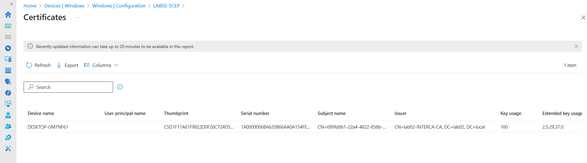
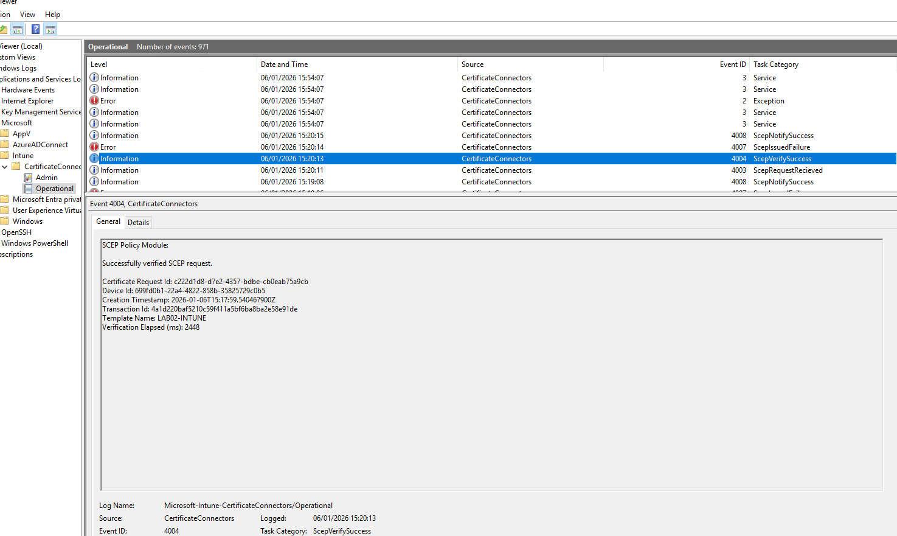
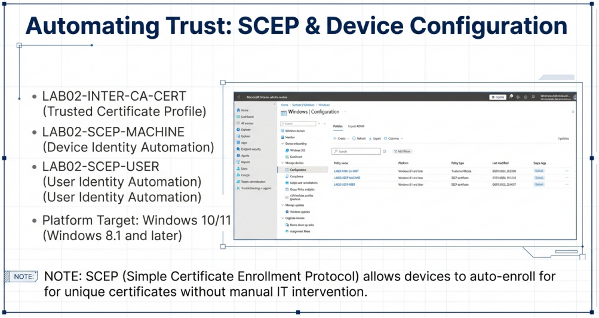
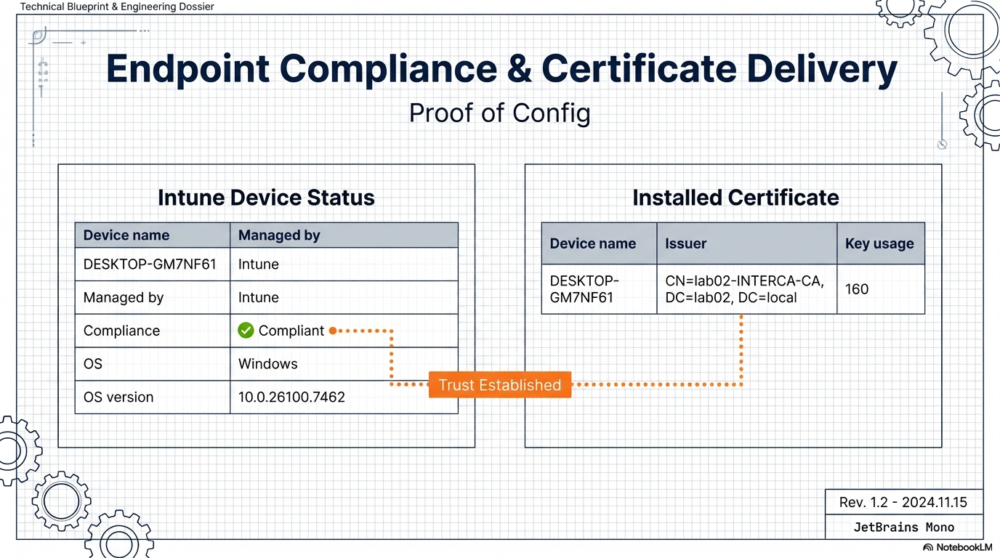
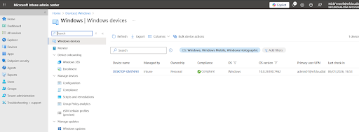
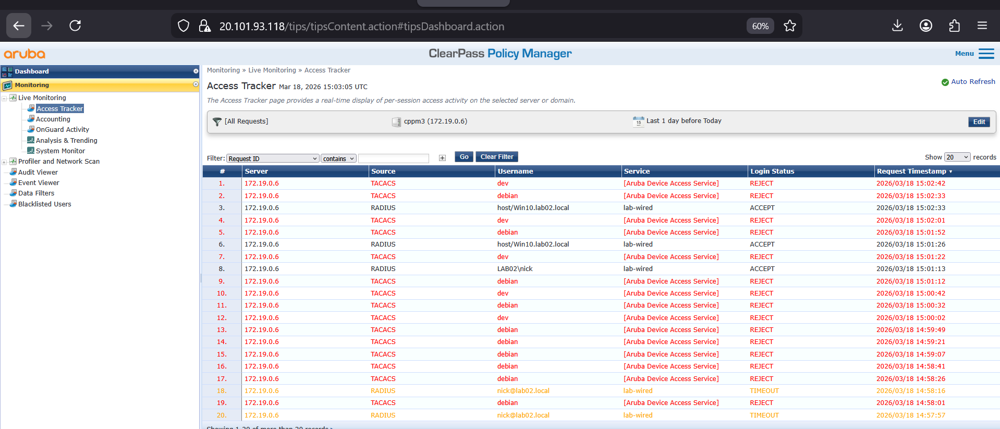
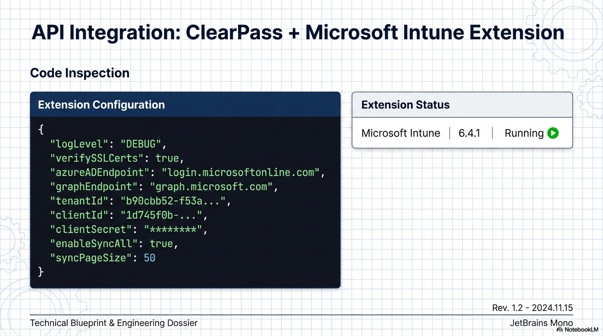
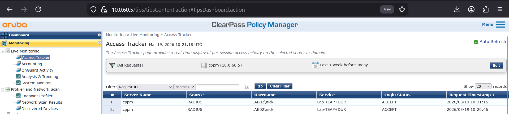
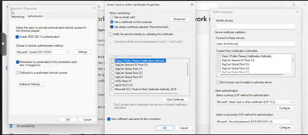

# Validation Proof: Identity Policy and Compliance Engine

This folder contains the technical evidence validating the integration between Aruba ClearPass, Microsoft Intune, and the Aruba AOS-CX switching fabric.

## Table of Contents
* [1. SCEP & NDES Certificate Lifecycle](#1-scep--ndes-certificate-lifecycle)
* [2. Cloud Identity & Compliance Status](#2-cloud-identity--compliance-status)
* [3. ClearPass Policy Processing (PDP)](#3-clearpass-policy-processing-pdp)
* [4. Switch Enforcement & DUR (PEP)](#4-switch-enforcement--dur-pep)

---

## 1. SCEP & NDES Certificate Lifecycle
The following evidence confirms the automated issuance of machine certificates. This proves the "Registration Authority" handshake is functional via the Azure App Proxy.

* **NDES/Intune Verification:** 
* **Intune Connector Logs (Event 4004):** 
* **App Proxy Success:** 
* **SCEP Enrollment Profile:** 

---

## 2. Cloud Identity & Compliance Status
Before network access is granted, the device must exist in the cloud inventory and meet the "Healthy" posture requirements.

* **Global Compliance Dashboard:** 
* **Individual Device Health Status:** 
* **ClearPass-to-Intune Attribute Mapping:** 

---

## 3. ClearPass Policy Processing (PDP)
These logs demonstrate ClearPass acting as the **Policy Decision Point (PDP)**. It validates the certificate, checks the Intune compliance attribute, and issues the RADIUS Accept.

* **TEAP/PEAP Service Configuration:** 
* **Access Tracker: RADIUS Handshake:** 
* **Intune Extension Logic:** 
* **DUR Authorization Profile:** 

---

## 4. Switch Enforcement & DUR (PEP)
The final stage of the handshake. The **Aruba AOS-CX** switch acts as the **Policy Enforcement Point (PEP)**, downloading and applying the user role.

* **CLI: Port-Access Client Status:** 
* **Client-Side Connection Success:** 

---

## Access Validation-Proof Hub
Validation evidence and configuration exports for this service are centralized in the module-level hub. 

* **Full Architecture Blueprint:** [Automated_Zero_Trust_Architecture.pdf](Automated_Zero_Trust_Architecture.pdf)
* **Connection Anatomy Visual:** 

---

**Navigation**
[Back to Parent Category](../) | [Back to Main Architecture](../../README.md)