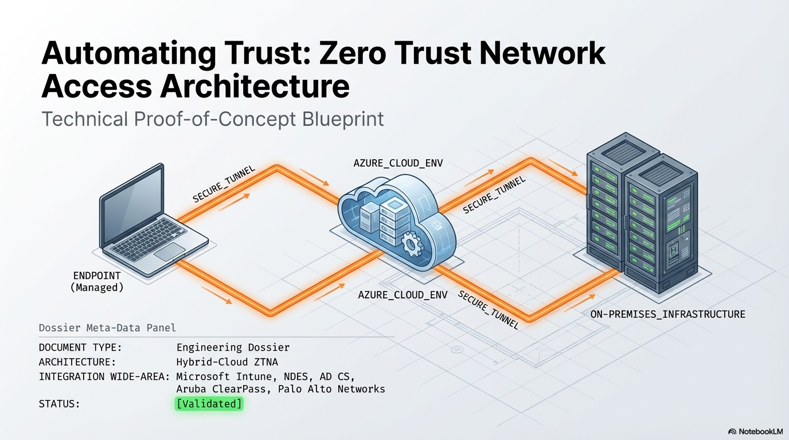
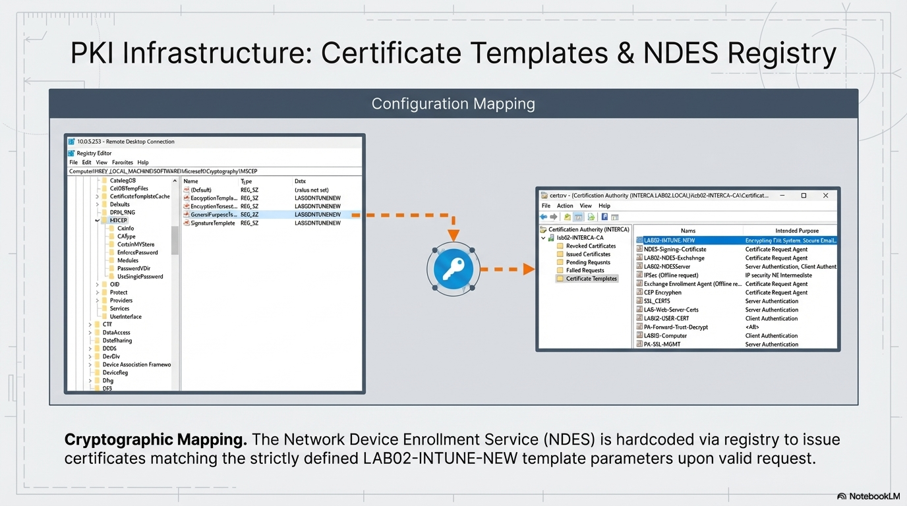
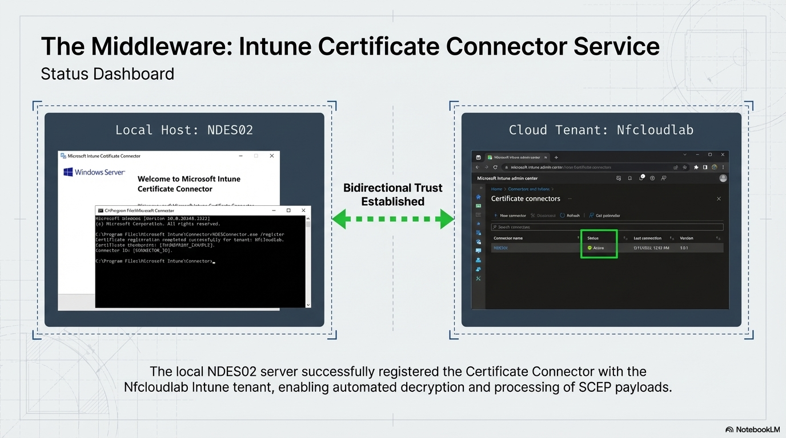
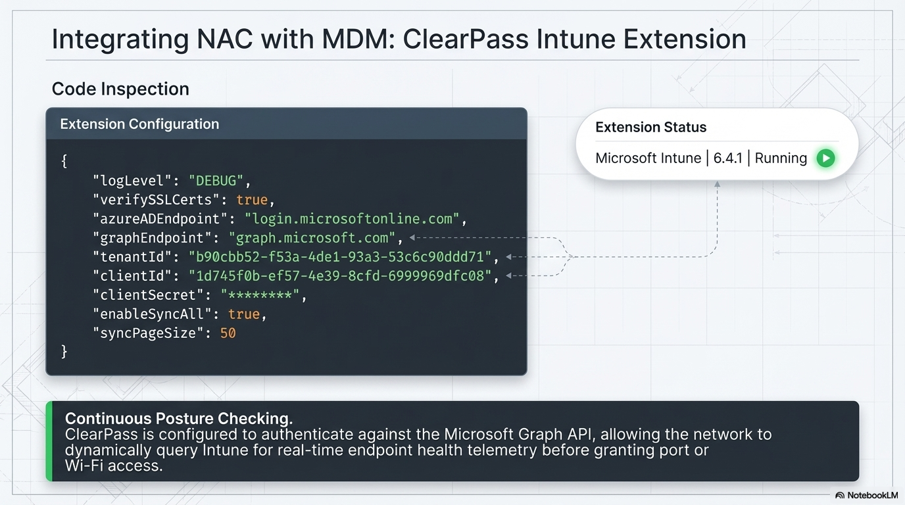
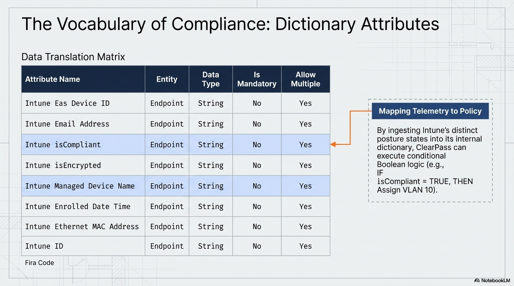
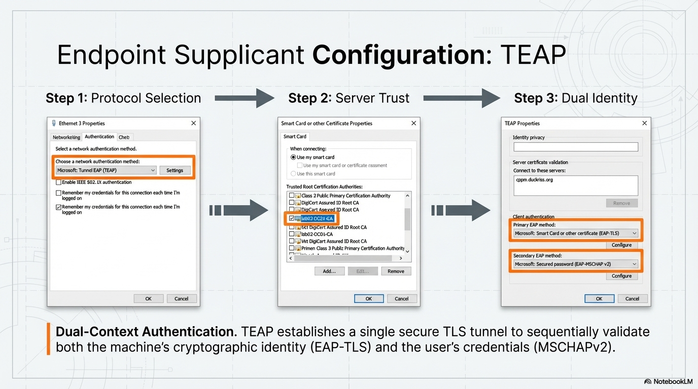
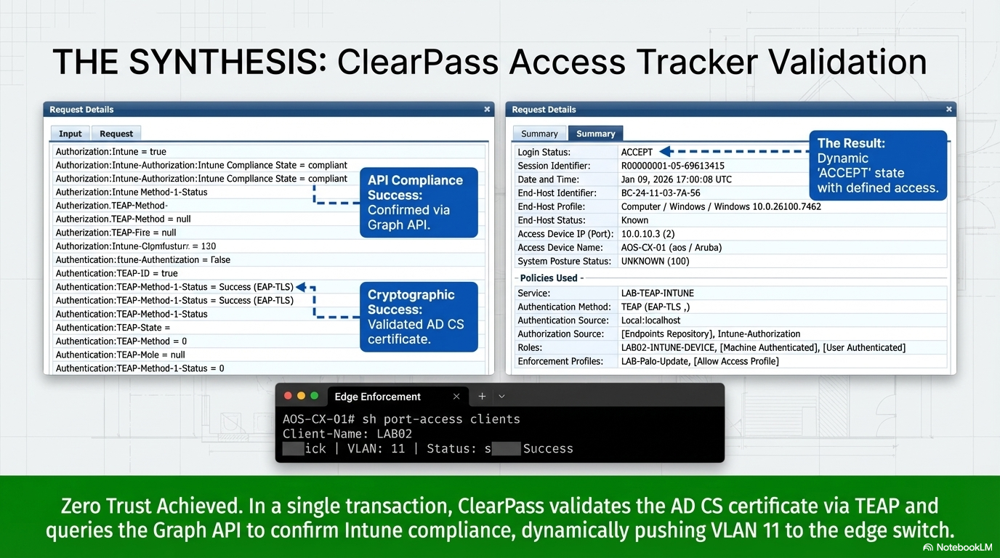
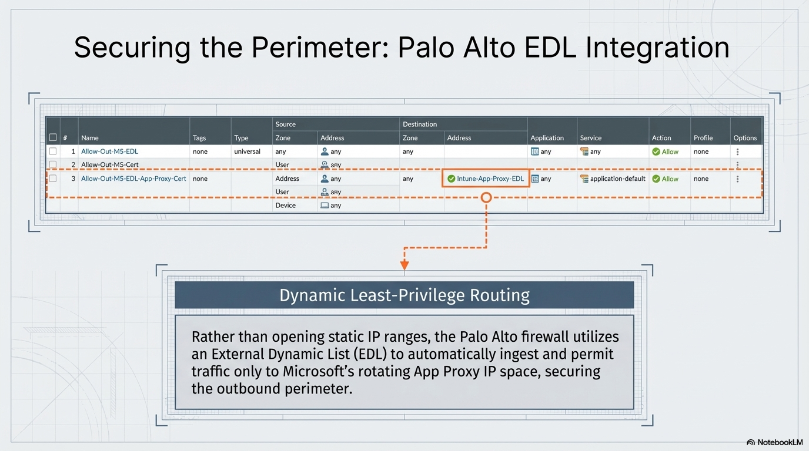
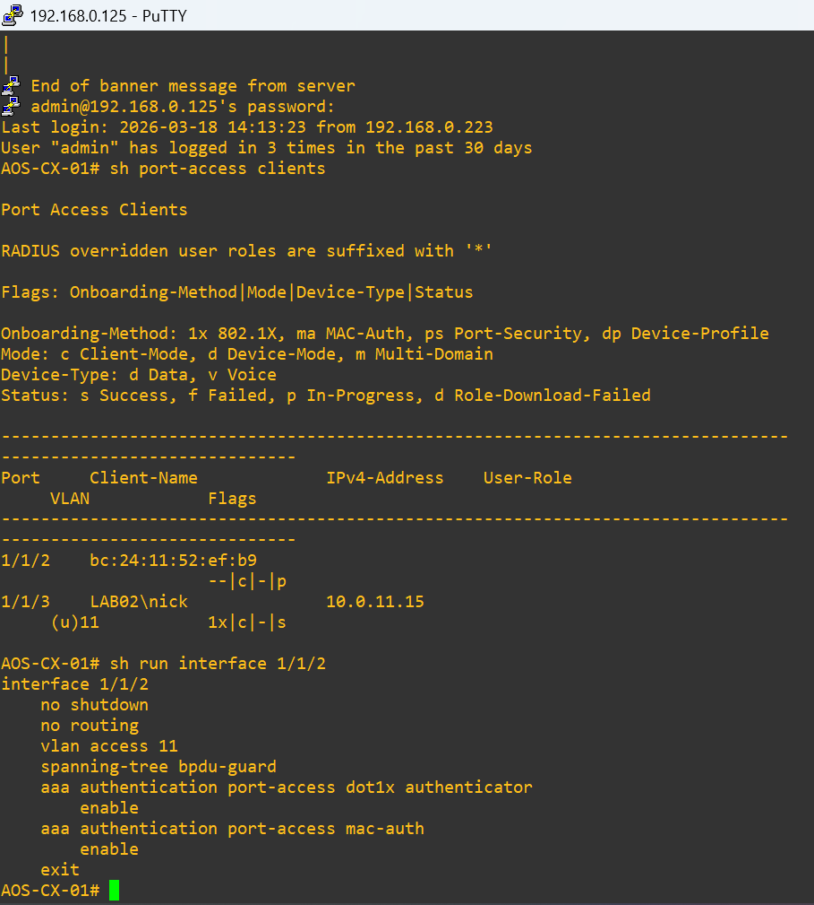
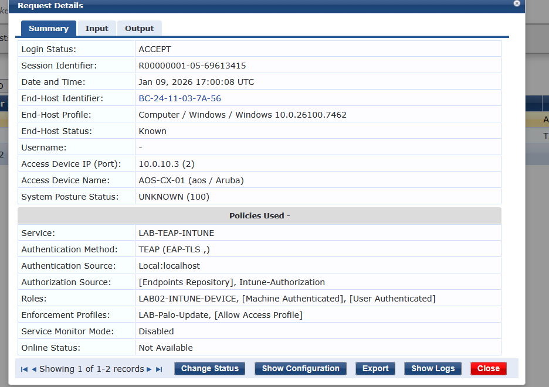

# Validation Proof: Identity and Policy Engine

This folder contains the engineering blueprints and technical logs validating the Zero Trust Network Access (ZTNA) logic. This module represents the policy decision point where cryptographic identity and device posture are translated into network authorization.

## Table of Contents
* [1. ZTNA Macro-Architecture](#1-ztna-macro-architecture)
* [2. Identity and PKI Automation](#2-identity-and-pki-automation)
* [3. NAC and MDM Integration (ClearPass and Intune)](#3-nac-and-mdm-integration-clearpass-and-intune)
* [4. Endpoint Readiness and Compliance](#4-endpoint-readiness-and-compliance)
* [5. Final Synthesis and Enforcement](#5-final-synthesis-and-enforcement)

---

## 1. ZTNA Macro-Architecture
High-level engineering dossiers illustrating the end-to-end integration of managed endpoints, hybrid cloud bridges, and the on-premises core.

* **ZTNA Master Blueprint:** 
* **Hybrid-Cloud Engineering Dossier:** 
* **Identity Synchronization Foundation:** 

---

## 2. Identity and PKI Automation
Validation of the secure outbound tunnel (App Proxy) and the SCEP certificate delivery pipeline.

* **Data Flow: Secure Outbound Tunneling:** 
* **Telemetry: App Proxy Execution:** 
* **Cryptographic Mapping (NDES Registry):** 
* **Middleware Status: Intune Certificate Connector:** 

---

## 3. NAC and MDM Integration (ClearPass and Intune)
Evidence of the policy engine querying the Microsoft Graph API to verify device health before granting access.

* **Automating Device Identity (SCEP Logic):** 
* **End-to-End Cryptographic Delivery:** 
* **Middleware Configuration: ClearPass Intune Extension:** 
* **Data Translation Matrix (Compliance Dictionary):** 

---

## 4. Endpoint Readiness and Compliance
Validation of the client-side state and the chained authentication protocol (TEAP) used to verify both machine and user.

* **Authentication Evolution: Why TEAP?:** 
* **Endpoint Supplicant Configuration:** 
* **Pre-Authentication Readiness:** 

---

## 5. Final Synthesis and Enforcement
The successful conclusion of the ZTNA lifecycle, showing the transition from an unauthenticated request to a dynamic "ACCEPT" state.

* **Synthesis: The Zero Trust Lifecycle:** 
* **Edge Enforcement Verification:** 
* **ClearPass Access Tracker Detail:** 

---

## Navigation
[Back to Main Architecture](../../README.md)