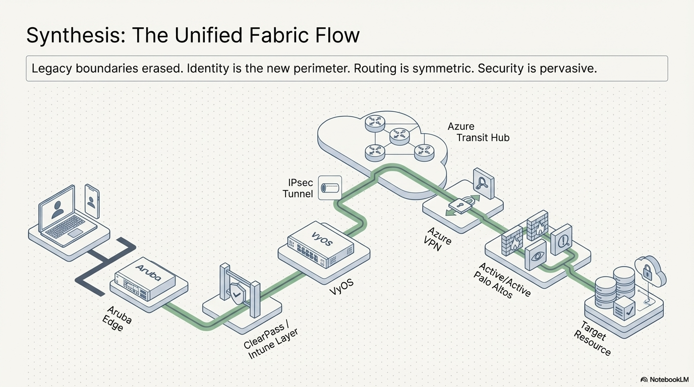

# Zero-Trust Identity Fabric
## Full-Stack Enterprise ZTNA and Hybrid Cloud Transit Hub

---

## 1. Executive Summary: The Technical Flow
This architecture demonstrates a production-hardened Hybrid Zero Trust environment. It orchestrates a high-fidelity handshake between on-premises infrastructure and Azure Cloud Services to enforce identity-based access across a distributed fabric.

**Project Context:** This is a 100% greenfield environment engineered entirely from scratch. As a solo project, I was responsible for the end-to-end deployment of all physical/virtual network appliances (VyOS, Palo Alto, Aruba), the bare-metal Proxmox hypervisor, and the complete deployment of all core systems architecture, including Windows Server AD DS, DNS, Enterprise Certificate Authority (PKI/NDES), and the Microsoft Entra ID / Intune hybrid integrations.

[View Advanced Engineering Analysis](./docs/engineering-analysis.md)

---

## 2. Repository Structure
This repository is organized into modular engineering phases:

* **[01-infrastructure-core](./01-infrastructure-core/):** Physical and virtualized baseline. Includes Proxmox hypervisor networking, VyOS edge logic, and on-premises firewalling.
* **[02-transit-security-hub-azure](./02-transit-security-hub-azure/):** The cloud security edge. Contains the Azure Transit VNet, NVA HA Load Balancers, and Gateway UDR steering logic.
* **[03-identity-policy-engine](./03-identity-policy-engine/):** The Zero Trust brain. Documents ClearPass (CPPM) services, TEAP/EAP-TLS authentication methods, and Intune/Entra ID integration.
* **[artifacts](./artifacts/):** Centralized backup of all raw configuration files (Azure ARM JSON, Palo Alto XML, and AOS-CX TXT).
* **[docs](./docs/):** Technical deep dives, engineering analysis, and SIEM/SecOps observability documentation.

---

## 3. Breaking the Perimeter Paradox
This architecture was designed to solve the inherent security and routing limitations of legacy enterprise networks. The comparison below outlines the core engineering shifts implemented in this fabric.

| Architectural Domain | Legacy Enterprise Network | Zero-Trust Identity Fabric |
| :--- | :--- | :--- |
| **Network Access** | Static IP Address & VLAN | User, Device Health, & Context |
| **Trust Boundary** | Static Network Perimeter | Dynamic, Micro-Segmented Enclaves |
| **Access Enforcement** | Static Allow/Deny ACLs | Dynamic User Roles (DUR) |
| **Routing and Traffic** | Asymmetric Hub-and-Spoke | Symmetric Policy-Based Forwarding |
| **Certificate Retrieval** | Inbound Ports to SCEP/NDES | Outbound via Entra App Proxy |

---

## 4. Key Technical Challenges Solved

* ### [Cloud-Native Device Authorization (ClearPass Intune Extension)](./docs/tech-notes/8021x-clearpass-cx.md)
  * **The Challenge:** As endpoints migrate to Entra ID (Cloud-Only), they no longer exist within the on-premises Active Directory. This renders legacy Domain Controllers incapable of acting as the Identity Authority for machine-level authentication.
  * **The Solution:** Orchestrated a solution using the ClearPass Intune Extension as the real-time authorization source. This allows ClearPass to query Intune via real-time API lookups to confirm both device identity and compliance state before granting access.

* ### [Dynamic Micro-Segmentation & Downloadable User Roles (DUR)](./docs/tech-notes/8021x-clearpass-cx.md)
  * **The Challenge:** Statically configuring access control lists (ACLs) and VLANs on every edge switch port creates massive administrative overhead and violates Zero Trust principles.
  * **The Solution:** Eliminated static VLANs and ACLs at the edge. Upon successful 802.1X/TEAP authentication, Aruba AOS-CX switches dynamically download and enforce the exact firewall policies and roles directly from ClearPass.

* ### [Active/Active Hybrid Transit and Path Isolation](./docs/tech-notes/palo-azure-transit.md)
  * **The Challenge:** Eliminating NVA "pinning." Terminating all hybrid traffic on a single tunnel forces a single appliance to handle all encrypted flows, preventing horizontal scaling and symmetric load balancing across the cluster.
  * **The Solution:** Engineered a Dual-Path Transit strategy using tunnel-state isolation. On-premises **Internet-bound traffic** is routed via a direct tunnel (Tunnel 300) to the NVA; by keeping this path disconnected from the Spokes, it bypasses the ILB for egress to avoid asymmetry. Conversely, **Internal Spoke-bound traffic** is routed via the VPN Gateway (Tunnel 200). This "normalizes" the traffic by decoupling decryption from inspection, allowing the **Internal Load Balancer (ILB) VIP** to distribute clear flows symmetrically across all active Palo Alto NVAs.

* ### [Outbound-Only Certificate Retrieval](./docs/tech-notes/pki-scep-lifecycle.md)
  * **The Challenge:** Legacy connections for certificate retrieval require opening inbound firewall ports (80/443) to a SCEP/NDES server, creating a significant security risk.
  * **The Solution:** Eliminated the need for inbound firewall ports by leveraging Entra App Proxy for secure, outbound-only SCEP/NDES certificate retrieval via the Microsoft Intune Certificate Connector.

---

## 5. Prerequisites and Environment Baseline
To fully replicate this environment using the provided infrastructure-as-code and configuration artifacts, the following baseline is required:

* **Cloud Infrastructure:** A Microsoft Azure Subscription.
* **Identity and Access:** A Microsoft Entra ID tenant (P1/P2) and an active Intune MDM environment.
* **Identity Policy Engine:** Aruba ClearPass Policy Manager (CPPM).
* **On-Premises Infrastructure:** Proxmox Hypervisor: 1 Bare Metal host running the entire infrastructure (SDDC).
* **Physical Hardware:** 1 Aruba Instant Access Point (IAP) for wireless edge termination and Aruba AOS-CX Switching.
* **Appliance Licensing:** Evaluation Licenses for Palo Alto VM-Series (PAN-OS), Aruba ClearPass, and Microsoft Server components.

---

## 6. Reproducibility and Environment Authoring
Every technical artifact in this repository was custom-engineered to function within this unified fabric. 

The **[Artifacts Folder](./artifacts/)** serves as a centralized source of truth for the complete environment state:

* **Custom Cloud IaC:** Azure ARM JSON templates for the Transit Hub.
* **Security Policy Engineering:** Full Palo Alto XML configuration exports.
* **Network Infrastructure State:** Aruba AOS-CX CLI configuration files.
* **Server Infrastructure:** Windows Server configuration for AD DS, NDES, and SCEP services.

---

## 7. Detailed Engineering Deep-Dives
* [Proxmox Networking and VyOS NAT Logic](./docs/tech-notes/proxmox-networking.md)
* [PKI Lifecycle: SCEP, NDES, and Intune](./docs/tech-notes/pki-scep-lifecycle.md)
* [Hybrid Transit: Palo Alto to Azure S2S](./docs/tech-notes/palo-azure-transit.md)
* [Identity Edge: 802.1X and DUR Logic](./docs/tech-notes/8021x-clearpass-cx.md)
* [Palo Alto Security and User-ID Integration](./docs/tech-notes/palo-alto-security.md)
* [Secure Guest WiFi Anatomy](./docs/tech-notes/guest-wifi-anatomy.md)
* [Entra App Proxy for NDES](./docs/tech-notes/entra-app-proxy.md)
* [ArubaOS-CX Switching and Port Access](./docs/tech-notes/aruba-cx-switching.md)
* [ClearPass Advanced Services](./docs/tech-notes/clearpass-advanced-services.md)
* [SIEM and SecOps: Centralized Logging](./docs/tech-notes/secops-siem-observability.md)
* [Offensive Validation and Pentesting](./docs/tech-notes/pentesting-offensive-validation.md)

---

* [Access Validation-Proof Hub](./artifacts/)
* [Technical Deep-Dives Hub](./docs/)
* [Back to Parent Category](../)
* [Back to Main Lab Architecture](./)
* [Back to Top](#zero-trust-identity-fabric)