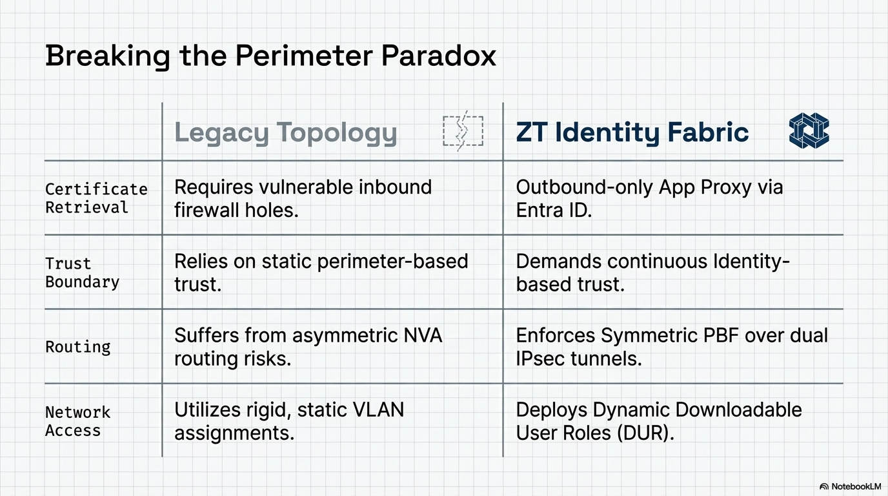

# Zero-Trust Identity Fabric
## Full-Stack Enterprise ZTNA and Hybrid Cloud Transit Hub

---

## 1. Executive Summary: The Technical Flow
This architecture demonstrates a production-hardened Hybrid Zero Trust environment. It orchestrates a high-fidelity handshake between on-premises infrastructure and Azure Cloud Services to enforce identity-based access across a distributed fabric.

**Project Context:** This is a 100% greenfield environment engineered entirely from scratch. As a solo project, I was responsible for the end-to-end deployment of all physical/virtual network appliances (VyOS, Palo Alto, Aruba), the bare-metal Proxmox hypervisor, and the complete deployment of all core systems architecture, including Windows Server AD DS, DNS, Enterprise Certificate Authority (PKI/NDES), and the Microsoft Entra ID / Intune hybrid integrations.

[View Advanced Engineering Analysis](./docs/engineering-analysis.md)

---

## 2. Repository Structure
This repository is organized into modular engineering phases:

* **[01-infrastructure-core](./01-infrastructure-core/):** Physical and virtualized baseline. Includes Proxmox hypervisor networking, VyOS edge logic, and on-premises firewalling.
* **[02-transit-security-hub-azure](./02-transit-security-hub-azure/):** The cloud security edge. Contains the Azure Transit VNet, NVA HA Load Balancers, and Gateway UDR steering logic.
* **[03-identity-policy-engine](./03-identity-policy-engine/):** The Zero Trust brain. Documents ClearPass (CPPM) services, TEAP/EAP-TLS authentication methods, and Intune/Entra ID integration.
* **[artifacts](./artifacts/):** Centralized backup of all raw configuration files (Azure ARM JSON, Palo Alto XML, and AOS-CX TXT).
* **[docs](./docs/):** Technical deep dives, engineering analysis, and SIEM/SecOps observability documentation.

---

## 3. Breaking the Perimeter Paradox
This architecture was designed to solve the inherent security and routing limitations of legacy enterprise networks. The comparison below outlines the core engineering shifts implemented in this fabric.

| Architectural Domain | Legacy Enterprise Network | Zero-Trust Identity Fabric |
| :--- | :--- | :--- |
| **Identity Context** | Source IP Address and VLAN | User, Device Health, and Certificate |
| **Trust Boundary** | Static Network Perimeter | Dynamic, Micro-Segmented Enclaves |
| **Access Enforcement** | Static Allow/Deny ACLs | Dynamic User Roles (DUR) and TEAP Chaining |
| **Routing and Traffic** | Asymmetric, Hub-and-Spoke | Symmetric Policy-Based Forwarding (PBF) |
| **Hybrid Scaling** | IPsec on Firewall (Active/Passive bottleneck) | IPsec on Azure Gateway (Active/Active ILB) |

---

## 4. Key Technical Challenges Solved

* ### [Active/Active Hybrid Transit and Centralized Internet Breakout](./docs/tech-notes/palo-azure-transit.md)
  * **The Challenge:** In enterprise environments where centralized security posture is a requirement, on-premises internet breakout traffic (egress) is often backhauled through the cloud security hub for inspection. However, terminating hybrid IPsec tunnels directly on a pair of NVAs behind a load balancer typically forces an Active/Passive state. This creates a scalability bottleneck that restricts total throughput and prevents the efficient use of expensive NVA compute.
  * **The Solution:** Decoupled the decryption layer by terminating IPsec tunnels on the native Azure VPN Gateway. The gateway routes decrypted traffic to an Internal Load Balancer (ILB) VIP, allowing both Palo Alto NVAs to operate in a true Active/Active state. This ensures hardware ROI while maintaining high-performance centralized egress inspection.

* ### [Symmetric Routing and Split-Tunnels](./docs/tech-notes/palo-azure-transit.md)
  Solved asymmetric routing challenges for dual IPsec tunnels. Engineered Policy-Based Forwarding (PBF) to ensure return traffic is pinned to the correct stateful firewall.

* ### [Hybrid 802.1X and the ClearPass Intune Extension](./docs/tech-notes/8021x-clearpass-cx.md)
  * **The Challenge:** Traditional 802.1X only validates user credentials, ignoring the health and compliance of the connecting hardware.
  * **The Solution:** Orchestrated the secure routing of on-premises RADIUS traffic to a cloud-resident ClearPass policy engine. By leveraging the **ClearPass Intune Extension**, the system performs real-time API lookups to Microsoft Intune, ensuring only managed and compliant devices gain access to the secure internal fabric.

* ### [Outbound-Only Certificate Retrieval (Intune Connector)](./docs/tech-notes/pki-scep-lifecycle.md)
  * **The Challenge:** Providing on-premises certificates to managed devices usually requires opening inbound firewall ports (80/443) to a SCEP/NDES server, creating a significant security risk.
  * **The Solution:** Leveraged the **Microsoft Intune Certificate Connector** in conjunction with **Entra App Proxy**. This creates a secure, outbound-only communication channel where Intune proxies certificate requests to the internal NDES server without requiring any inbound firewall exceptions.

---

## 5. Prerequisites and Environment Baseline
To fully replicate this environment using the provided infrastructure-as-code and configuration artifacts, the following baseline is required:

* **Cloud Infrastructure:** A Microsoft Azure Subscription with permissions for Virtual Network Gateways and Standard Load Balancers.
* **Identity and Access:** A Microsoft Entra ID tenant (P1/P2) and an active Intune MDM environment with the **Microsoft Intune Certificate Connector** installed.
* **Identity Policy Engine:** Aruba ClearPass Policy Manager (CPPM) with the **ClearPass Intune Extension** configured for device telemetry.
* **On-Premises Infrastructure:** Proxmox Hypervisor: 1 Bare Metal host running the entire infrastructure (SDDC).
* **Physical Hardware:** 1 Aruba Instant Access Point (IAP) for wireless edge termination.
* **Appliance Licensing:** This project utilizes **Evaluation Licenses** for all Palo Alto VM-Series (PAN-OS), Aruba ClearPass, and Microsoft server components.

---

## 6. Reproducibility and Environment Authoring
Every technical artifact in this repository was custom-engineered to function within this unified fabric. The **[Artifacts Folder](./artifacts/)** serves as a centralized source of truth for the complete environment state:

* **Custom Cloud IaC:** Azure ARM JSON templates for the Transit Hub, NVA HA Clusters, and UDR logic.
* **Security Policy Engineering:** Full Palo Alto XML configuration exports and security policy sets.
* **Network Infrastructure State:** Aruba AOS-CX CLI configuration files and VyOS edge routing logic.
* **Server Infrastructure:** Windows Server configuration for Active Directory DS, NDES, and SCEP certificate services.

---

## 7. Detailed Engineering Deep-Dives
* [Proxmox Networking and VyOS NAT Logic](./docs/tech-notes/proxmox-networking.md)
* [PKI Lifecycle: SCEP, NDES, and Intune](./docs/tech-notes/pki-scep-lifecycle.md)
* [Hybrid Transit: Palo Alto to Azure S2S](./docs/tech-notes/palo-azure-transit.md)
* [Identity Edge: 802.1X and DUR Logic](./docs/tech-notes/8021x-clearpass-cx.md)
* [Palo Alto Security and User-ID Integration](./docs/tech-notes/palo-alto-security.md)
* [Secure Guest WiFi Anatomy](./docs/tech-notes/guest-wifi-anatomy.md)
* [Entra App Proxy for NDES](./docs/tech-notes/entra-app-proxy.md)
* [ArubaOS-CX Switching and Port Access](./docs/tech-notes/aruba-cx-switching.md)
* [ClearPass Advanced Services](./docs/tech-notes/clearpass-advanced-services.md)
* [SIEM and SecOps: Centralized Logging](./docs/tech-notes/secops-siem-observability.md)
* [Offensive Validation and Pentesting](./docs/tech-notes/pentesting-offensive-validation.md)

---

## Cloud Networking
## Evidence & Audit

Validation evidence and configuration exports for this service are centralized in the module-level hub.

* [Access Validation-Proof Hub](./artifacts/)
* [Technical Deep-Dives Hub](./docs/)
* [Back to Parent Category](../)
* [Back to Main Lab Architecture](./)
* [Back to Top](#zero-trust-identity-fabric)