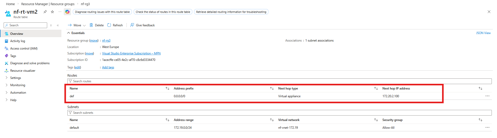
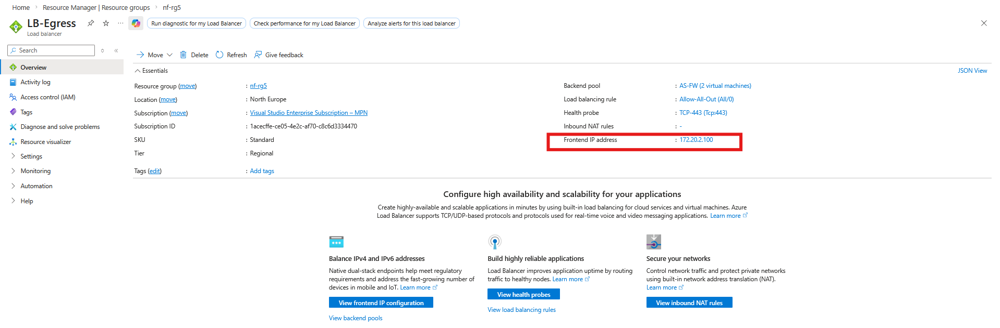
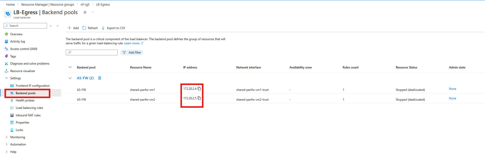

# Azure Routing and UDR Design (Transit Hub)

This document provides a detailed breakdown of Azure routing within the Transit Security Hub, including User-Defined Routes (UDRs), Internal Load Balancer behaviour, and traffic steering constraints.

---

## Overview

Azure routing is used to enforce a **“no shortcut”** policy where all hybrid and inter-spoke traffic must pass through the NVA layer for inspection.

This is achieved using:

- User-Defined Routes (UDRs)  
- Internal Load Balancer (ILB)  
- GatewaySubnet route enforcement  

---

## GatewaySubnet Routing Constraint

Azure does not allow a standard default route (`0.0.0.0/0`) to be applied to the GatewaySubnet.

To work around this limitation, the design uses split default routes:

- `0.0.0.0/1`  
- `128.0.0.0/1`  

These two routes combined cover the entire IPv4 address space and allow full traffic steering.

---

## Spoke Routing Model

All spoke subnets use:

- `0.0.0.0/0 → Internal Load Balancer (ILB)`

This ensures:

- All traffic is inspected  
- No bypass of the NVA layer  
- Centralised security enforcement  

---

## Internal Load Balancer Behaviour

The ILB acts as the next-hop for all internal traffic and distributes flows across NVAs.

- Session Persistence: None (5-tuple hash)  
- Each flow is pinned to a single NVA  
- No mid-session movement  

This design requires:

- Symmetric routing  
- Deterministic traffic paths  

---

## Traffic Flow Summary

1. Traffic enters via VPN Gateway  
2. GatewaySubnet UDR redirects to ILB  
3. ILB forwards to NVA  
4. NVA inspects and routes traffic  

This ensures:

- Full inspection  
- Centralised control  
- No direct spoke-to-spoke routing  

---

## Key Outcome

Azure routing enforces:

- Mandatory inspection via NVAs  
- No routing shortcuts  
- Full alignment with Zero Trust principles  

---

## Related Components

- [Transit Security Hub](../../02-transit-security-hub-azure/)  
- [NVA Routing Deep Dive](./palo-alto-security.md)

---

## Navigation

[Back to Tech Notes](./README.md) | [Back to Main Architecture](../../README.md)