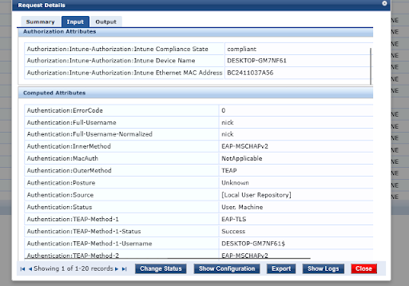

# ClearPass Policy Manager: Services and Hybrid PKI

This document details the configuration of the Aruba ClearPass Policy Manager (CPPM), focusing on the hybrid certificate strategy and the multi-stage service logic used to enforce Zero Trust across the fabric.

## 1. Hybrid PKI and Trust Architecture
The lab utilises a two-tier certificate strategy to balance granular internal security with seamless automated orchestration.

* **Internal PKI (RADIUS/EAP-TLS):** Workstation and user identity certificates are issued by the internal Microsoft CA.
    * **Benefit:** Ensures non-exportable, TPM-backed keys for managed endpoints. Since these devices are domain-joined, they trust the internal root natively.
* **Public PKI (HTTPS/DUR/Guest):** The ClearPass web and RADIUS-server certificate for `cppm.duckdns.org` is issued by **Let's Encrypt**.
    * **Benefit:** Because Let's Encrypt is a public authority, ArubaOS-CX switches and guest devices trust the portal automatically. This enables seamless **Downloadable User Roles (DUR)** and removes "insecure connection" warnings on the guest captive portal.

## 2. Core Authentication: TEAP and Intune Compliance
The primary service for managed endpoints utilises **Tunnelled EAP (TEAP)** to verify both the machine and the user in a single transaction.

ClearPass acts as the critical bridge between the local network and the Azure cloud for real-time compliance validation.

* **Mechanism:** During the handshake, ClearPass queries the **Microsoft Graph API** for the device's compliant status.
* **Decision:** If Intune reports the device as non-compliant, ClearPass overrides the standard role and assigns a quarantine role, blocking access to the internal `10.0.0.0/8` range.

## 3. Advanced Services: Onboard and OnGuard
To support a diverse device ecosystem, ClearPass provides specialised onboarding and health-check workflows.

* **ClearPass Onboard (BYOD):** Provides a self-service portal for non-managed or personal devices. It acts as an internal CA to issue unique device certificates, removing the reliance on weak credentials or PSKs.
* **ClearPass OnGuard (Posture):** The OnGuard agent performs real-time health checks (antivirus status, disk encryption, patch levels). If a device fails health checks, ClearPass sends a **RADIUS CoA** to the switch to dynamically isolate the port.

## 4. Guest Access and MAC Caching (VLAN 50)
The guest lifecycle is fully automated to provide secure access with minimal administrative overhead.

* **Self-Registration:** Guests connect to the 'lab' SSID and are redirected to the `cppm.duckdns.org` registration portal.
* **MAC Caching:** Once registered, ClearPass caches the device MAC address for 24 hours. Returning guests are identified via MAC-auth and granted access automatically, bypassing the portal while their session is valid.
* **Isolation:** ClearPass instructs the infrastructure to place these devices in **VLAN 50**, where the Palo Alto NVA enforces strict internet-only outbound policies.

---

**Navigation**

[Back to Engineering Analysis](../engineering-analysis.md) | [Back to Main Architecture](../../README.md)