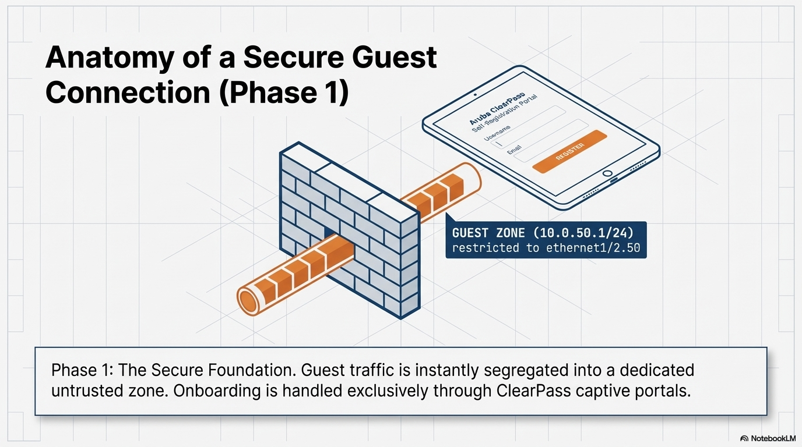
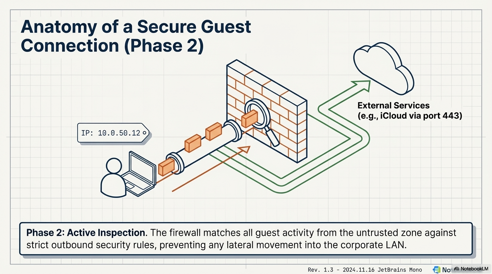

# Deep-Dive: Secure Guest WiFi Anatomy

This document provides a comprehensive technical breakdown of how the lab fabric provides secure, NAC-driven internet access to untrusted devices while enforcing strict segmentation from the corporate LAN.

## 1. Executive Engineering Overview

The entire guest connection lifecycle is visualised in the following high-level engineering schematic. This blueprint connects the conceptual segmentation with the active data flow and security policy enforcement.

This schematic highlights the critical relationship between the standard network hardware and the identity-driven security policies enforced by Aruba ClearPass and the Palo Alto NVA.

## 2. Phase 1: Building the Secure Foundation (Segregation)

* **Layer 2 Isolation:** Guest traffic is tagged on a dedicated, isolated **VLAN 50** from the virtual Aruba Access Point to the physical ArubaOS-CX virtual switch and up to the firewall sub-interface.
* **Zone Security:** A dedicated "Guest Zone" (`10.0.50.1/24`) is created on the Palo Alto NVA, physically restricted to the `ethernet1/2.50` sub-interface. This zone has 0 trust by default.
* **NAC Onboarding:** All device onboarding and captive portal redirection is handled exclusively through **Aruba ClearPass** to ensure identity validation.

## 3. Phase 2: The Guest Connection in Action (Inspection & Policy)

* **Self-Registration Portal:** The user connects to the 'LAB' SSID and is redirected to the customised Aruba ClearPass self-registration portal to complete onboarding.
* **Active Security Inspection:** Every packet originating from the Guest Zone is subjected to active Layer 7 security inspection by the Palo Alto Threat Prevention engine.
* **Policy in Action:** Strict implicit-deny rules block all lateral movement from the Guest Zone (`10.0.50.1/24`) into the primary `10.0.0.0/8` internal subnets.

---
[Back to Engineering Analysis](../engineering-analysis.md) | [Back to Main Architecture](../../README.md)