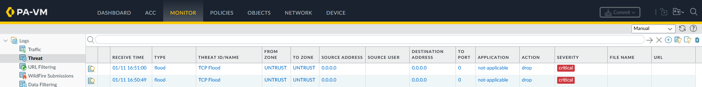

# Deep-Dive: White Hat Pentesting & Offensive Security Validation

## 1. Controlled Attack Simulation (Kali Linux)
To validate the **Zero Trust** and **Threat Prevention** policies, a dedicated **Kali Linux VM** was used to perform reconnaissance and exploit attempts against the core infrastructure.

### Test Cases:
* **DoS Attack Simulation:** Executed a TCP Flood attack against the external interface to test Zone Protection and flood-mitigation thresholds.
* **Internal Reconnaissance:** Performed stealth scanning and service discovery to test for lateral movement opportunities between security zones.
* **Policy Enforcement:** Attempted to bypass URL filtering and application control profiles to verify identity-based blocking.

## 2. Palo Alto "Proof of Protection"
The success of the security posture is verified by the **Palo Alto Threat Logs**. The firewall successfully identified and dropped malicious traffic in real-time based on signature matching and behavioral analysis.

### Evidence: Threat Prevention Logs
The monitor tab captures the exact moment the TCP Flood attack was mitigated by the firewall's protection profiles.

* **Threat Name:** TCP Flood
* **Action:** Drop
* **Severity:** Critical

### Evidence: Policy Enforcement & Blocking
User-ID and URL filtering profiles ensure that unauthorized application usage is met with an explicit block page, preventing unauthorized data egress.

## 3. Operational Conclusion
The correlation between the **Kali Terminal** (showing connection failures) and the **Palo Alto Monitor Tab** serves as the definitive proof of the lab's defensive efficacy. This validation cycle ensures that the security architecture is effective against modern attack vectors.

---
**Navigation**
[Back to Engineering Analysis](../engineering-analysis.md) | [Main Architecture](../../README.md)