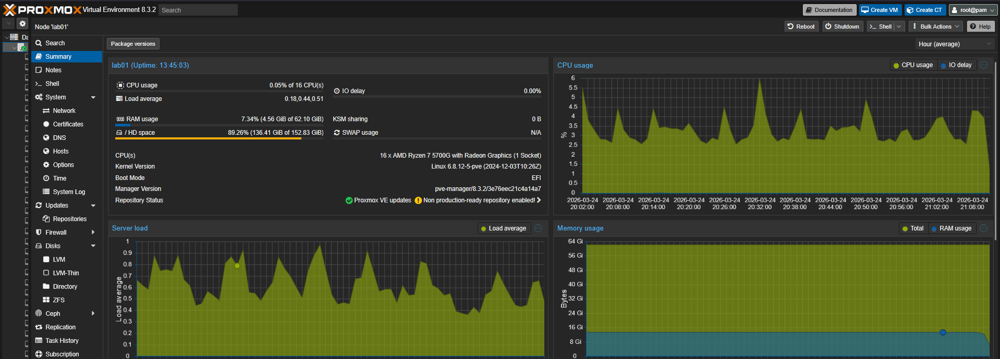

# Proxmox Networking and Hypervisor Logic

This document details the virtualization foundation and the specific kernel-level tuning required to support high-fidelity enterprise networking, 802.1X authentication, and symmetric routing.

## 1. Physical Infrastructure & Hypervisor Mapping
The Proxmox VE host acts as the physical-to-virtual bridge, utilizing dedicated Network Interface Cards (NICs) to isolate administrative traffic from the secure lab environment.

### Host Hardware Resources
To prevent latency during complex RADIUS/TACACS+ processing and Layer 7 firewall inspection, the host is provisioned with high-performance consumer silicon and sufficient memory overhead.


### Virtual Machine Inventory
The following deployment confirms the core Identity, Security, and Routing appliances operating on the hypervisor. 


### Interface Configuration
* **Management Interface:** Connected to the physical network for hypervisor administration (Web GUI/SSH).
* **Lab Trunk (vmbr1/vmbr22):** A VLAN-aware Linux bridge that carries the 802.1Q trunk. This supports the segmented architecture for VLANs 10, 20, 30, 40, 50, and 60.

## 2. Advanced EAPOL Forwarding (802.1X Support)
A standard Linux bridge acts as a MAC-layer proxy and typically consumes or drops IEEE 802.1X reserved group MAC frames. To allow **EAPOL (Extensible Authentication Protocol over LAN)** packets to pass from the endpoints to the virtual ArubaOS-CX switch and ClearPass cluster, a specific kernel mask is applied.

### The group_fwd_mask Tweak
The bridge is configured to forward restricted L2 frames rather than terminating them at the hypervisor layer.

**Kernel Configuration (/etc/network/interfaces):**
```bash
auto vmbr22
iface vmbr22 inet manual
        bridge-ports none
        bridge-stp off
        bridge-fd 0
        post-up /bin/sh -c 'echo 8 > /sys/class/net/$IFACE/bridge/group_fwd_mask'

---

[Back to Engineering Analysis](../engineering-analysis.md) | [Back to Main Architecture](../../README.md)