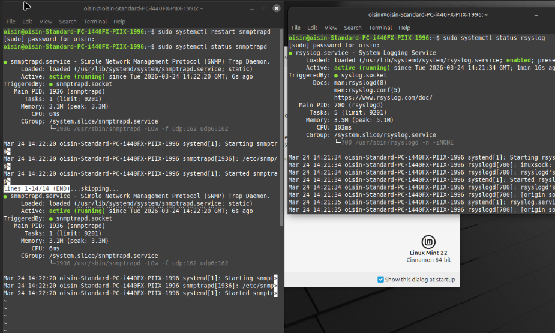

# siem and secops: centralized logging and visibility

This document details the observability framework used to monitor, audit, and respond to security events across the zero trust fabric.

## 1. linux management and logging node
The lab utilizes a dedicated on-premises linux server (Linux Mint 22) to act as the central management and telemetry hub.

* **syslog collector (`rsyslog`):** the server aggregates and archives security logs from clearpass, the palo alto nva, and arubaos-cx switches.
* **snmp target (`snmptrapd`):** the node is configured as an snmp trap destination and polling target, allowing it to provide hardware and service metadata to clearpass for device profiling.

## 2. snmp-driven device profiling
Clearpass uses snmp as an active profiling method to refine its understanding of the network environment.
* **mechanism:** cppm performs active snmp polling of the linux management node to read host resource mibs.
* **identity validation:** this data allows clearpass to verify the operating system and running services before granting privileged network access.
* **network visibility:** by polling the infrastructure, clearpass maintains a real-time bridge table mapping mac addresses to physical switch ports.

## 3. centralized audit and forensic trail
The integration of syslog and snmp data on the linux node creates a comprehensive audit trail for every device on the network.
* **profiling event:** clearpass identifies a device via snmp and dhcp fingerprinting.
* **authentication event:** the linux syslog captures the radius accept/reject decision from cppm.
* **continuous monitoring:** any changes in device status or unauthorized configuration attempts are logged for forensic investigation.

## 4. validation via kali linux
The effectiveness of this logging and profiling is validated using a kali linux instance within the lab.
* **scenario:** simulating an unauthorized device attempting to spoof the linux management node's identity.
* **result:** clearpass identifies a profiling mismatch via snmp and dhcp, logs a security alert to the linux syslog server, and triggers a coa (change of authorization) to block the unauthorized port.

---

[back to engineering analysis](../engineering-analysis.md)